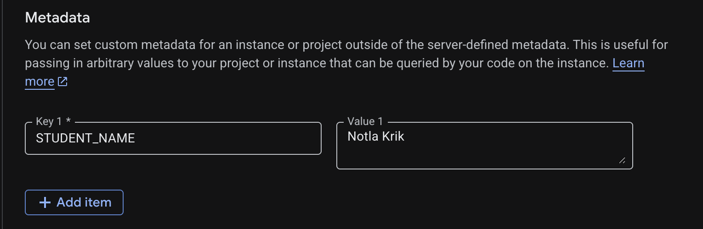
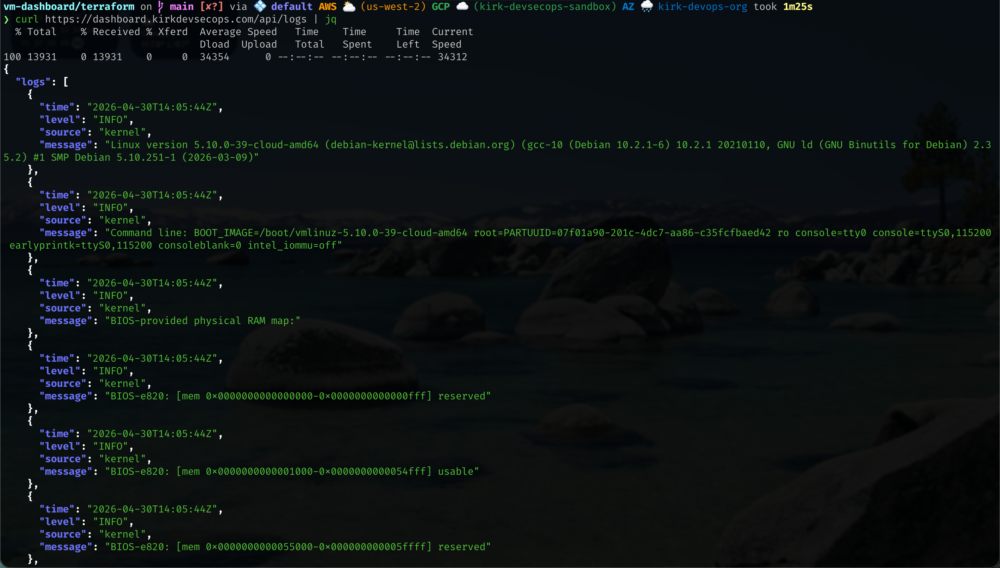
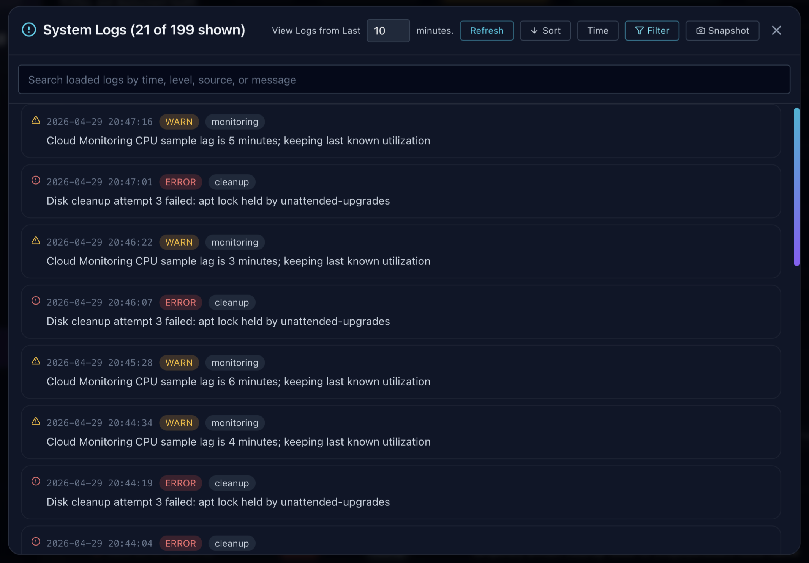

# Dashboard API Configuration

The API server (`scripts/dashboard_api.py`) provides live data for the dashboard via:

* `/api/dashboard` – full dashboard payload (used by the frontend)
* `/api/dashboard/summary` – public DevSecOps summary cards and metadata needed before sign-in
* `/api/finops` – cost, budget, utilization, and recommendation payload
* `/api/finops/summary` – public FinOps summary cards needed before sign-in
* `/api/config` – static API settings
* `/api/logs` – paginated `journalctl` logs with optional time-window filtering
* `/metadata` – instance metadata + health object
* `/healthz` – basic service health check

It runs as a **systemd service** on the VM (port `8080`).

> [!IMPORTANT]
> Public traffic reaches the API through Nginx. Nginx protects `/api/dashboard`, `/api/finops`, `/api/logs`, and `/metadata` with Basic Auth and rate limiting. The summary endpoints remain public so the top dashboard cards can load before sign-in.

> [!IMPORTANT]
> DevSecOps and FinOps use separate Basic Auth credentials.

> [!IMPORTANT]
> The public DevSecOps summary redacts CPU, Memory, Disk, and Estimated Cost values as `Protected`; signed-in DevSecOps users receive can view live utilization and estimated VM cost payload from `/api/dashboard`.

> [!IMPORTANT]
The public FinOps summary redacts Total Cost MTD, Forecast EOM, Potential Savings, and CUD Coverage as `Protected`; signed-in FinOps users receive live Total Cost MTD and Forecast EOM values from `/api/finops`.

---

## User-Configurable Variable

At the top of the file, you will find:

```python
# -------------------------------
# API Customization
# -------------------------------
STUDENT_NAME = "Kirk Alton"

# Your billing account ID (hardcoded for reliability)
BILLING_ACCOUNT_ID = "01BB2F-8195CD-645BC0"
```

* **`STUDENT_NAME`** – Appears in the `/metadata` response under the `STUDENT_NAME` field.
* **`BILLING_ACCOUNT_ID`** – Used by `get_budgets()` when calling `gcloud billing budgets list`.

> [!NOTE]
> `STUDENT_NAME` is only used for display in the metadata endpoint.
> It does **not** affect functionality or system behavior.

---

## Metadata Override Behavior (Important)

The API includes a runtime override:

```python
student_name = get_metadata("instance/attributes/STUDENT_NAME")
if student_name in ("unknown", ""):
    student_name = STUDENT_NAME
```

> [!IMPORTANT]
> If a **GCP instance metadata attribute** named `STUDENT_NAME` exists, it will override the hardcoded value in `dashboard_api.py`.

### Practical Implication

```text
GCP Metadata Attribute: STUDENT_NAME (if present)
        ↓
Overrides
        ↓
STUDENT_NAME in Python
```

> [!TIP]
> This allows you to set `STUDENT_NAME` **without modifying code**, using instance metadata instead.

#### Example via gcloud CLI

Add instance metadata attribute for `STUDENT_NAME`

```bash
gcloud compute instances add-metadata vm-dashboard \
  --zone us-central1-a \
  --metadata STUDENT_NAME="Notla Krik"
```



Then restart the API on the VM:

```bash
sudo systemctl restart dashboard-api.service
```

---

## Configuration Boundary

```bash
# =================================
# END OF CONFIGURATION
# ---------------------------------
# Modify sections below with caution.
# ==================================
```

> [!IMPORTANT]
> Treat this as a **hard boundary**:
>
> * Above → safe for basic API customization
> * Below → core application logic (API, metrics, system calls)

---

# Dashboard Output Customization – API Fields & Metadata

This section outlines how the values returned by the API are structured and where they originate. It is intended for users who want to adjust what appears in the dashboard or metadata endpoints.

---

## Output Structure Overview

The API exposes three main data outputs:

* **`/api/dashboard`** – main dataset used by the frontend UI
* **`/api/dashboard/summary`** – limited public DevSecOps dataset for top cards with protected utilization values redacted
* **`/api/finops`** – FinOps dataset used by the signed-in FinOps UI, including live Total Cost MTD and Forecast EOM values
* **`/api/finops/summary`** – limited public FinOps dataset for top cards with protected cost values redacted
* **`/metadata`** – structured instance and health information

These outputs are constructed in two locations:

```text
build_dashboard_data()        → /api/dashboard and /api/dashboard/summary
get_cached_finops_data()      → /api/finops and /api/finops/summary
MonitoringHandler (/metadata) → /metadata
```

> [!NOTE]
> Any changes to displayed values are derived from these two sections of the codebase.

---

## Dashboard Data (`/api/dashboard`)

The dashboard UI is driven by a single structured object returned by `build_dashboard_data()`.

### Key Sections

```text
summaryCards
vmInformation
services
security
meta
logs
resourceTable
identity
network
location
systemResources
```

Each section represents a logical grouping of data displayed in the UI.

The dashboard preview uses the `logs` array returned by `/api/dashboard`. The full log modals load from `/api/logs` so they can paginate beyond the preview.

---

### Field Composition

Most display elements follow a consistent structure:

```json
{
  "label": "CPU",
  "value": "25%",
  "status": "healthy"
}
```

> [!TIP]
> Maintaining this structure ensures compatibility with the frontend rendering logic.

---

### Data Sources

Values in the dashboard are derived from:

* System files (`/proc`, `df`, `uptime`)
* Cloud metadata (`get_metadata`)
* Helper functions (`get_*`)
* Environment variables (`os.environ`)
* Local files (e.g., staged shared assets, cost cache)
* GCP APIs for FinOps data (BigQuery, Monitoring, Recommender, Budgets)

> [!NOTE]
> DevSecOps values are computed locally or via metadata. FinOps values use GCP APIs when the required IAM and billing export are configured.

---

## Clipboard JSON Payload Structure

The dashboard supports JSON copy/export actions from the graphical header and Text Mode. These payloads are generated by the frontend from the latest loaded dashboard data. They are intended for sharing, troubleshooting, ticket notes, and lightweight evidence capture; they are not a separate API endpoint.

The JSON payloads are built in `dashboard-advanced/dashboard/src/utils/snapshot.js` and use stable top-level sections so they are easy to inspect or parse.

### DevSecOps JSON Payload

The DevSecOps header `{}` button and Text Mode `[J] COPY JSON` action produce a JSON object with these top-level sections:

```json
{
  "snapshot": {},
  "status": {},
  "identity": {},
  "overview": {},
  "network": {},
  "location": {},
  "load": {},
  "monitoring_endpoints": [],
  "services": {},
  "system_logs": [],
  "alerts": {},
  "recommended_actions": [],
  "metadata": {}
}
```

Key behavior:

* `snapshot.taken_at` uses an ISO 8601 timestamp.
* `overview` normalizes CPU, memory, disk, and estimated monthly cost.
* `services.items` respects the current service copy limit.
* `system_logs` includes the currently selected dashboard log window.
* Missing values are represented as `null` where practical instead of invented placeholder text.

### FinOps JSON Payload

The FinOps header `{}` button produces a JSON object with these top-level sections:

```json
{
  "snapshot": {},
  "summary": {},
  "daily_cost_trend": [],
  "top_services_by_cost": [],
  "budgets": [],
  "cpu_utilization": [],
  "rightsizing_recommendations": [],
  "idle_resources": [],
  "metadata": {}
}
```

Key behavior:

* `snapshot.period` identifies the month-to-date reporting period.
* `summary` includes total cost MTD and forecast EOM.
* `budgets` includes name, status, spent, limit, and percent used.
* `rightsizing_recommendations` includes resource, recommendation, priority, and estimated monthly savings.
* `idle_resources` includes resource, type, scope, and status.

### System Logs JSON Payload

System Logs copy actions use a smaller JSON shape with a top-level `system_logs` array. This applies to individual row copies, widget snapshots, filtered modal snapshots, and Text Mode `[LS] SNAPSHOT`.

---

## Logs API (`/api/logs`)

The logs endpoint is built from `journalctl` JSON output:

```python
cmd = [journalctl_path, "--since", f"{minutes} minutes ago", "--no-pager", "-o", "json"]
```

When `minutes` is not provided, the endpoint reads the latest `ALL_LOGS_MAX_LINES` entries for general browsing:

```python
cmd = [journalctl_path, "-n", str(ALL_LOGS_MAX_LINES), "--no-pager", "-o", "json"]
```

It returns a paginated response:

```json
{
  "logs": [],
  "offset": 200,
  "hasMore": true,
  "total": 1432
}
```

Supported query parameters:

| Parameter | Purpose | Default |
| --------- | ------- | ------- |
| `limit` | Number of log rows to return | `100` |
| `offset` | Pagination offset for older logs | `0` |
| `minutes` | Optional time window in minutes | unset |

Each log row includes `time`, `level`, `source`, and `message`. The `time` field is an ISO 8601 UTC timestamp so API consumers can sort, filter, and parse log entries consistently.

```json
{
  "time": "2026-04-27T14:58:42Z",
  "level": "WARN",
  "source": "nginx",
  "message": "Upstream response time exceeded threshold for /api/dashboard"
}
```



`time` uses the `YYYY-MM-DDTHH:MM:SSZ` shape. The trailing `Z` indicates UTC. When `minutes` is provided, the API asks `journalctl` for logs from that relative time window with `--since`, then applies pagination to the returned rows. The frontend keeps the ISO value as the data contract for sorting and filtering, but formats it into local time for display. Refreshing the logs reloads the selected time window and clears active log filters.

### Frontend Log Copy Format

The API returns raw log rows with `time`, `level`, `source`, and `message`. For clipboard actions, the frontend converts selected log rows into a JSON snapshot payload with a top-level `system_logs` array:

```json
{
  "system_logs": [
    {
      "timestamp": "2026-04-27T14:58:42Z",
      "level": "WARN",
      "component": "storage",
      "message": "Root disk at 92% after npm build artifacts; 4.0 GB free"
    }
  ]
}
```

This JSON format is used for individual System Logs row copies, the System Logs widget snapshot, the System Logs custom-filter modal snapshot, and the Text Mode `[LS] SNAPSHOT` action.



---

## Metadata Endpoint (`/metadata`)

The `/metadata` endpoint returns a structured JSON object describing:

* Instance identity
* Network configuration
* Location (region/zone)
* System health (uptime, load, memory, disk)

---

### Metadata Structure

```JSON
"STUDENT_NAME": student_name,
"project_id": project_id,
"instance_id": instance_id,
"instance_name": instance_name,
"hostname": hostname,
"machine_type": machine_type,

"network": {
    "vpc": vpc,
    "subnet": subnet,
    "internal_ip": internal_ip,
    "external_ip": external_ip,
},

"region": region,
"zone": zone,
"startup_utc": startup_utc,
"uptime": uptime,

"health": {
    "uptime": uptime,
    "load_avg": load_avg_str,
    "ram_mb": ram_mb,
    "disk_root": disk_root
}
```

These values are derived from system-level helper functions and formatted for readability.

---

## Environment Variable Integration (Cross-Component)

The API reads dashboard branding values from environment variables:

```python
"meta": {
    "appName": os.environ.get("DASHBOARD_APP_NAME", "GCP Deployment"),
    "tagline": os.environ.get("DASHBOARD_TAGLINE", "Infrastructure health and activity"),
    "dashboardUser": os.environ.get("DASHBOARD_USER", "Kirk Alton"),
    "dashboardName": os.environ.get("DASHBOARD_NAME", "DevSecOps Dashboard"),
}
```

> [!IMPORTANT]
> These values are **not defined in this file**.
> They are exported by `app_bootstrap.sh` before the API service is started.

### Data Flow

```text
app_bootstrap.sh
    ↓ (exports ENV vars)
Linux environment
    ↓
dashboard_api.py (os.environ)
    ↓
/api/dashboard
    ↓
React frontend
```

> [!TIP]
> If branding values are incorrect in the UI, check:
>
> * Environment variables
> * systemd service restart
> * bootstrap script execution

---

## Required IAM Role (GCP)

> [!IMPORTANT]
> For the `/metadata` endpoint to return the correct **subnet name**, the VM’s service account must have:
> `roles/compute.viewer`

### Why This Is Required

* The metadata server may return incomplete network data
* The API falls back to:

```bash
gcloud compute instances describe ...
```

* This requires IAM read permissions

---

### Grant the Role (from local machine)

```bash
PROJECT_NUMBER=$(gcloud projects describe YOUR_PROJECT_ID --format="value(projectNumber)")
DEFAULT_SA="${PROJECT_NUMBER}-compute@developer.gserviceaccount.com"

gcloud projects add-iam-policy-binding YOUR_PROJECT_ID \
  --member="serviceAccount:${DEFAULT_SA}" \
  --role="roles/compute.viewer"
```

---

### Verify the Role

```bash
gcloud projects get-iam-policy YOUR_PROJECT_ID \
  --flatten="bindings[].members" \
  --format='table(bindings.role)' \
  --filter="bindings.members:serviceAccount:${DEFAULT_SA}"
```

> [!NOTE]
> Without this role, the subnet field will return `unknown`.

---

## Runtime Data & File Locations

The API relies on local system files and generated data:

* **Cost tracking**

  * File: `/var/tmp/vm-cost.json`
  * Persists across reboots
  * Used only by the DevSecOps **Estimated Cost** card

* **Quotes data**

  * File: `/var/www/vm-dashboard/data/quotes.json`
  * Staged from `shared/assets/quotes/quotes.json` during bootstrap and auto-deploy

* **Gallery data**

  * Manifest: `/var/www/vm-dashboard/data/gallery-manifest.json`
  * Images: `/var/www/vm-dashboard/data/images/`
  * Source: `shared/assets/images/image_gallery/`

* **BigQuery billing export**

  * Dataset: `billing_export`
  * Table pattern: `gcp_billing_export_v1_*`
  * Used by `get_cost_trend()` and `get_top_services_by_cost()`

> [!NOTE]
> If quotes or gallery assets stop updating, verify:
>
> * Shared quote and gallery files exist under `shared/assets`
> * File permissions

---

## Caching Behavior

The API uses lightweight memory caching plus VM-local JSON snapshots under `/var/cache/vm-dashboard`:

```python
@ttl_cache(seconds=10)
def build_dashboard_data()

def get_cached_dashboard_data()

def get_cached_finops_data()

@ttl_cache(seconds=60)
def get_ssh_status()

@ttl_cache(seconds=300)
def get_update_status()

@ttl_cache(seconds=3600)
def get_cost_trend(days=30)
```

* Reduces repeated system calls (`systemctl`, `apt`)
* Improves API responsiveness
* Keeps FinOps API calls from querying BigQuery and GCP APIs on every request
* Preserves a last-known-good DevSecOps and FinOps payload if a refresh fails

> [!TIP]
> Cached values may appear slightly stale. DevSecOps data is refreshed frequently and has a local fallback snapshot. FinOps data uses a VM-local file cache with a default 10-minute TTL, while individual lower-level cloud API helpers may cache for longer.

---

## System Data Sources

All system metrics are collected directly from the VM:

* `/proc` → CPU, memory, load
* `df` → disk usage
* `uptime` → system uptime
* `systemctl` → service health
* metadata server → instance details
* `journalctl` → `/api/logs` and dashboard log rows

> [!NOTE]
> Cloud Monitoring is used only for FinOps CPU utilization across VMs.

---

## Applying Changes

If you modify `scripts/dashboard_api.py` (e.g., update `STUDENT_NAME`, `BILLING_ACCOUNT_ID`, or logic), restart the service:

```bash
sudo systemctl restart dashboard-api.service
```

> [!IMPORTANT]
> Changes will not take effect until the service is restarted.

---

## Common Pitfalls

> [!CAUTION]
> Changes made but not visible? Check the following:

* Service not restarted
* Environment variables not updated
* Metadata override still active
* IAM role missing (subnet = `unknown`)

---
