# Features and Roadmap

## DevSecOps Mode

**DevSecOps Mode (default view)** – A real-time, graphical dashboard of infrastructure health. Optimized for live system metrics and quick access to VM information.
To enable, press `D` or click the **DevSecOps** button in the mode dropdown menu.

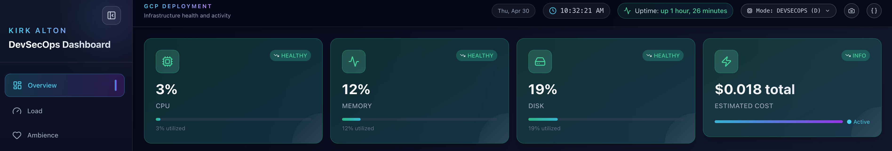

---

### Header Copy Controls

DevSecOps and FinOps modes share the same header copy controls:

| Button | Output |
| ------ | ------ |
| Camera icon | Copies the current dashboard snapshot |
| `{}` icon | Copies the current dashboard JSON payload |

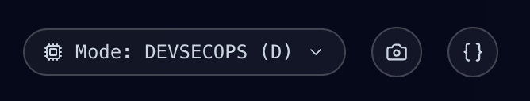

Both buttons use the same clipboard handling as widget-level copy actions. If the browser blocks clipboard access, the dashboard opens the Manual Copy modal with the generated snapshot or JSON payload selected. See [API Configuration](./API_CONFIG.md#clipboard-json-payload-structure) for the JSON payload structure.

If protected API access is not unlocked, dashboard snapshot and JSON payload actions open the appropriate sign-in modal instead of copying protected data. DevSecOps and FinOps use separate sign-ins.

---

### Header Auth Controls

Locked dashboards use a centralized **Sign In** menu in the header. The menu provides separate entries for **DevSecOps** and **FinOps** so each protected API surface can be unlocked independently.

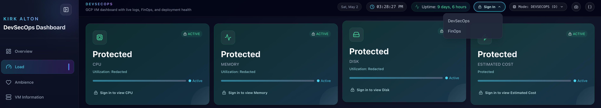

Selecting either protected area opens the sign-in modal for that dashboard scope. Press `Escape` or click the close button to dismiss the modal without signing in.

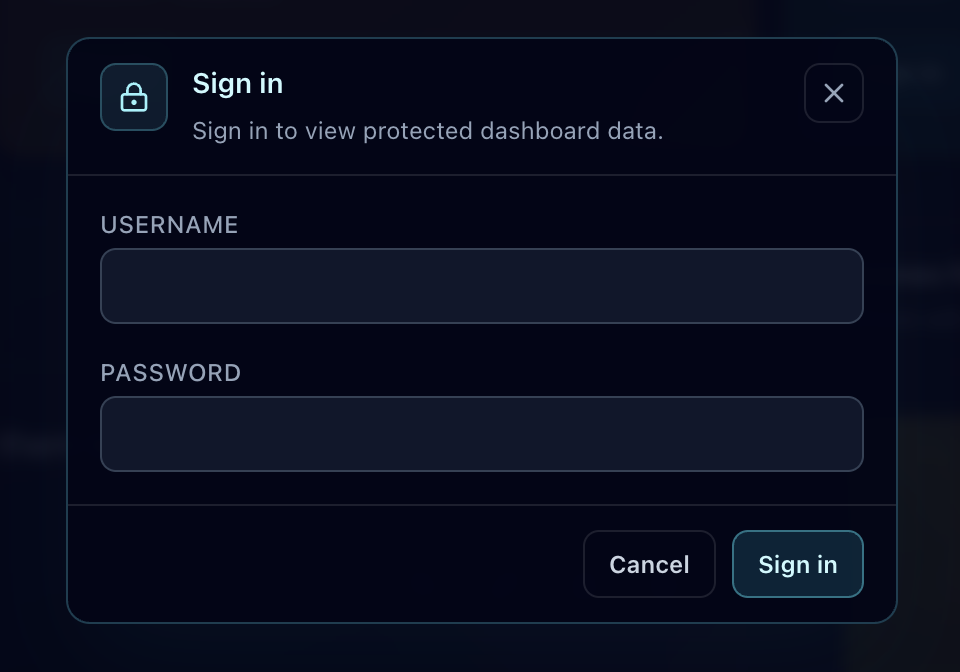

After sign-in, the same header menu becomes an account menu. **Sign Out** locks the current dashboard only. **Sign Out Everywhere** clears both DevSecOps and FinOps sessions and returns all protected views to their locked state.

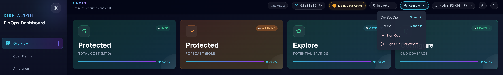

---

### Summary Cards

* Four interactive summary cards:

  * **CPU Usage** – protected utilization placeholder until sign-in
  * **Memory Usage** – protected utilization placeholder until sign-in
  * **Disk Usage** – protected root partition placeholder until sign-in
  * **Estimated Cost** – protected VM cost placeholder until DevSecOps sign-in

Before sign-in, these cards remain visible through the public summary endpoint. CPU, Memory, Disk, and Estimated Cost display `Protected` in the locked state.
CPU, Memory, and Disk also show `Utilization: Redacted` and an `Active` indicator instead of percentage bars. After DevSecOps sign-in, CPU, Memory, Disk, and Estimated Cost return to live values with their normal color-coded status bars.

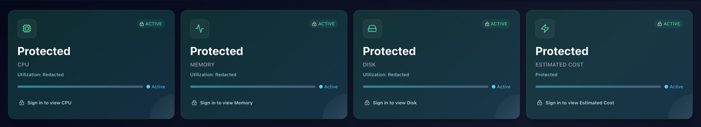

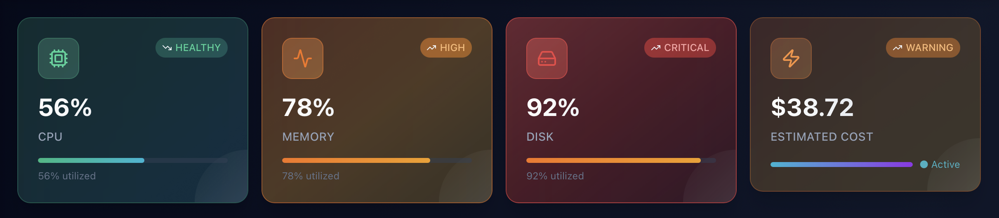

* Each card updates every **10 seconds** via the live API.

* **After DevSecOps sign-in, cards are clickable:**

  * **CPU / Memory / Disk** → GCP Compute Engine instance details page
  * **Estimated Cost** → GCP Billing overview

---

### Load

* **System Load (1m)** – current load average

* **Trend Chart** – bar graph of the last 10 samples (10s interval)

* **Detailed insights:**

  * Peak load (last 10 readings)
  * Average load
  * Color-coded status: Normal / Elevated / High / Critical

* Chart auto-rescales to peak load (capped at 5.0)

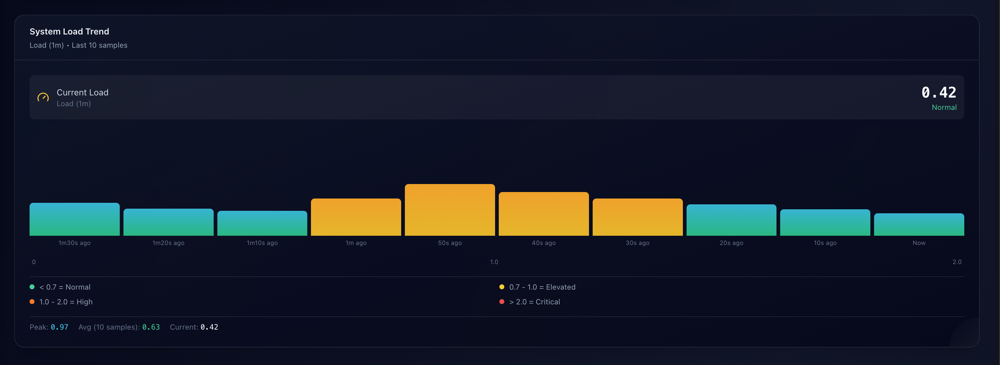

---

### VM Information

Grouped into three compact cards:

* **Identity**

  * Project ID
  * Instance ID
  * Instance Name
  * Hostname
  * Machine Type

* **Network**

  * VPC
  * Subnet
  * Internal IP
  * External IP

* **Location**

  * Region
  * Zone
  * Uptime (human-readable)
  * Load average (5m)

> All fields are fetched from the cloud metadata service (with fallbacks) and update live.

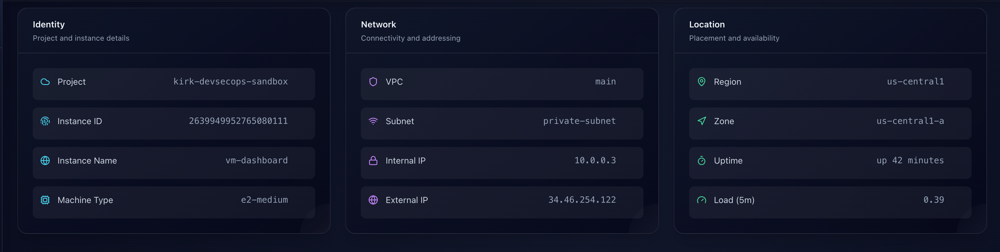

---

### System Resources

A detailed widget with three sections:

* **CPU**

  * Current usage (percentage bar)
  * Core count + frequency (if available)
  * **Live CPU Trend** – mini line chart (last 20 readings, 10s interval)

* **Memory**

  * Total / Used / Free (MB or GB)
  * Usage bar

* **Disk**

  * Total / Used / Available (MB or GB)
  * Usage bar

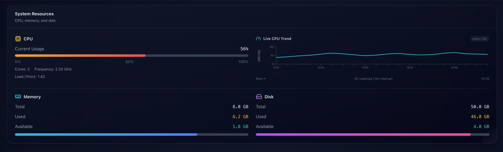

---

### Services

Displays health and status of key system components returned by `build_dashboard_data()`:

* **Nginx** – running / stopped

* **Python** – installed

* **Metadata Service** – reachable

* **HTTP Service** – serving

* **Startup Script** – completed

* **GitHub Quotes Sync** – successful

* **Bootstrap Packages** – installed packages list

* **Default view** – shows 10 services by default and displays `Showing X of X services`

* **View all services** – opens the full service list in a modal

* **Sort services** – cycles through Name A-Z, Name Z-A, Status Healthy-Critical, and Status Critical-Healthy

* **Filter services** – filters by service name and status


---

### System Logs

* Displays the last **30** log entries from `journalctl`

Each entry includes:

* Time (ISO 8601 UTC from the API, displayed locally in the UI)

* Level (info / warning / error)

* Scope/source (from `SYSLOG_IDENTIFIER`, truncated for display)

* Message

* **View all logs** – opens a modal backed by `/api/logs`

* **Show older logs** – appends paginated logs using the same ISO 8601 timestamp contract

* **Refresh logs** – reloads the currently selected time window

* **Sort logs** – cycles through Time Newest, Time Oldest, Level Error-Debug, Level Debug-Error, Source A-Z, and Source Z-A

* **Filter logs** – filters the currently loaded logs by level and source

* **Search logs** – searches loaded modal rows by time, level, source, or message

* **Copy logs** – individual log copies, widget snapshots, and custom-filter log snapshots use JSON with a top-level `system_logs` array


> Filters are client-side and apply to the logs currently loaded in the modal. They persist while paging older logs and reset on full refresh.
> When a filter modal is opened from another modal, closing it restores focus to the previous modal layer.

Example copied System Logs payload:

```json
{
  "system_logs": [
    {
      "timestamp": "2026-04-27T14:58:42Z",
      "level": "WARN",
      "component": "storage",
      "message": "Root disk at 92% after npm build artifacts; 4.0 GB free"
    }
  ]
}
```

---

### Mock / Fallback Data Warning

When any visible dashboard section is using bundled mock data or API fallback data, the header shows a red **Mock Data Active** diagnostic pill beside the date/time controls.

Clicking the pill opens a diagnostic panel that lists the affected sections and remediation guidance, including deployment configuration, API/service health, environment variables, and restart/redeploy steps.

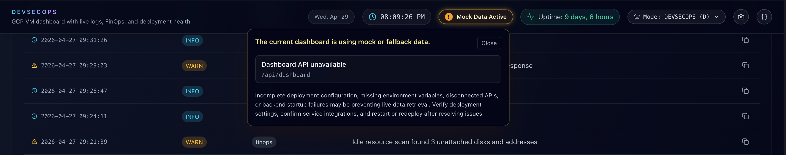

The warning hides automatically after the relevant live API responds successfully.

After live data has loaded once, a temporary API error does not replace the current dashboard with mock data. The UI keeps the last live payload visible and shows the diagnostic warning until the API recovers.

---

## Text Mode

A minimalist, terminal-style view of DevSecOps data. Optimized for keyboard navigation and copy-paste workflows.

To enable, press `T` or click **TEXT MODE** (top-right).

[PICTURE: Screenshot of Advanced Text Mode showing the cyan grid background, blocked Identity, Overview, Network, Location, Services, and Logs panels]

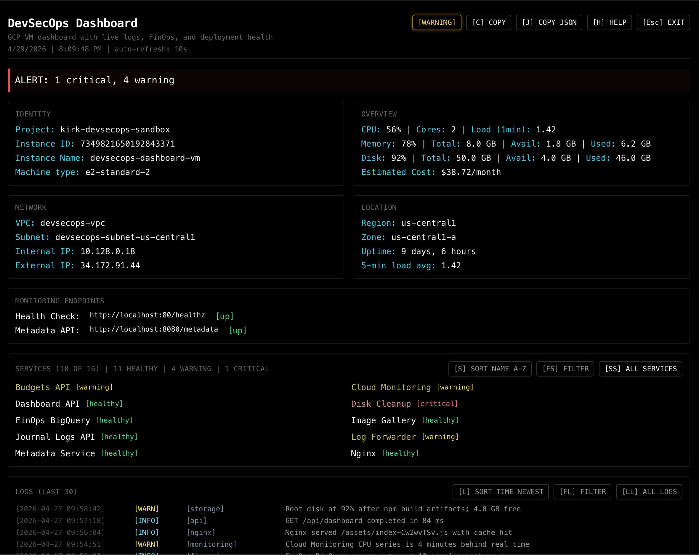

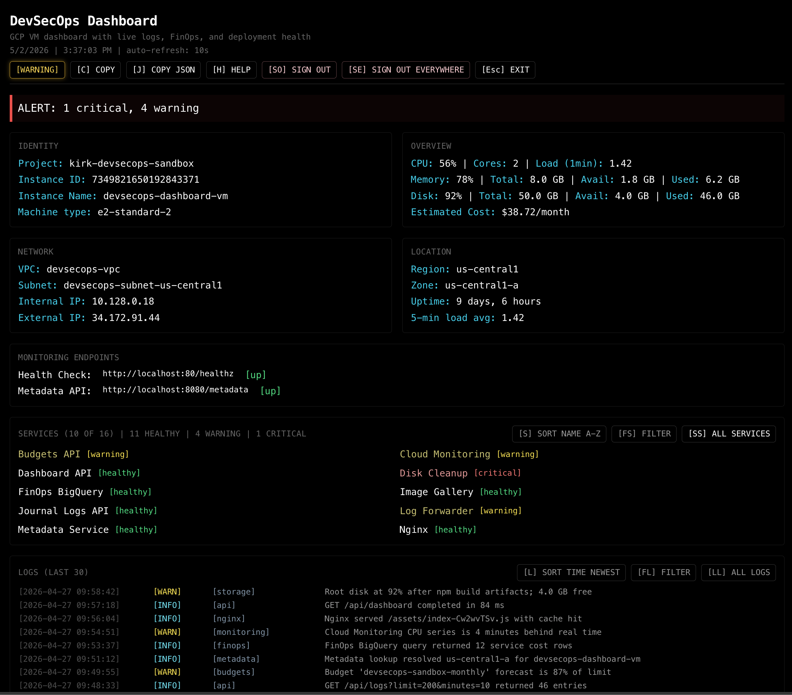

Displays:

* Identity, Overview, Network, Location
* Monitoring endpoints
* Services with the same 10-row default, sort, filter, and view-all behavior as DevSecOps mode
* System logs with Time, Level, Source, and Message columns
* Copy controls for dashboard text snapshots, dashboard JSON payloads, and loaded log snapshots
* `[WARNING]` in the top controls when mock or fallback data diagnostics are active

Exit with `Esc` or `[Esc] EXIT`.

---

### Keyboard Shortcuts

| Key   | Action                                     |
| ----- | ------------------------------------------ |
| `Esc` | Exit text mode                             |
| `C`   | Copy dashboard snapshot                    |
| `J`   | Copy dashboard JSON payload                |
| `H`   | Toggle help overlay                        |
| `L`   | Sort logs                                  |
| `FL`  | Filter logs                                |
| `LL`  | View all logs                              |
| `LS`  | Copy loaded logs snapshot as JSON          |
| `SO`  | Sign out of DevSecOps                      |
| `SE`  | Sign out everywhere                        |
| `S`   | Sort services                              |
| `FS`  | Filter services                            |
| `SS`  | View all services                          |

Text mode filter popups use the same filter options as the graphical dashboard:

* Arrow keys move through filter columns
* `Space` or `Enter` toggles a filter
* `Delete` or `Backspace` clears filters
* `Esc` closes the active popup and returns focus to the previous modal layer

Text mode log sorting cycles through Time Newest, Time Oldest, Level Error-Debug, and Level Debug-Error.

When `ALL SYSTEM LOGS` is open, press `R` to refresh the loaded log window and `LS` to copy the currently loaded/filter-matched logs as JSON.

[PICTURE: Screenshot of Advanced Text Mode help overlay showing copy, JSON, logs, services, and sign-out shortcuts]

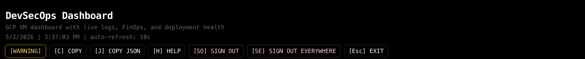

[PICTURE: Screenshot of Advanced Text Mode ALL SYSTEM LOGS modal with cyan terminal styling and LS snapshot control]

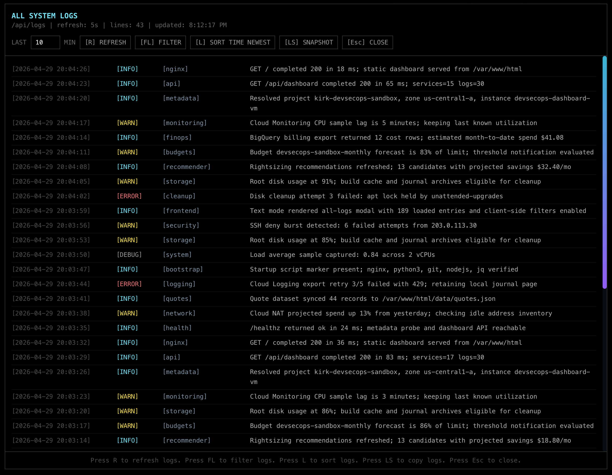

> [!TIP]
> Favorite quotes are saved in `localStorage` and persist across sessions.

---

## FinOps Mode

**FinOps Mode** – A cost-optimization dashboard for cloud spend, budgets, and usage.
To enable, press `F` or click the **FinOps** button.

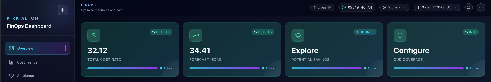

---

### Core Widgets

* **Total Cost (MTD)** – protected before sign-in; live month-to-date cost after FinOps sign-in

* **Forecast (EOM)** – protected before sign-in; live end-of-month forecast after FinOps sign-in

* **Potential Savings** – estimated savings from rightsizing

* **CUD Coverage** – placeholder (coming soon)

Before FinOps sign-in, FinOps summary cards remain visible through the public summary endpoint. Total Cost MTD, Forecast EOM, Potential Savings, and CUD Coverage display `Protected` in the locked state. Locked cards keep their normal identity icons, use redacted values, and do not expose billing or optimization links until sign-in.

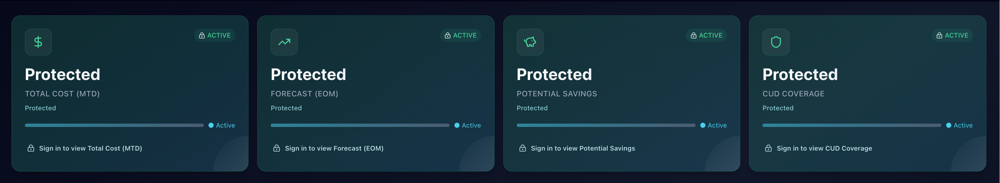

* **After FinOps sign-in, summary cards are clickable:**

  * **Total Cost / Forecast** → GCP Billing overview
  * **Potential Savings** → FinOps Hub
  * **CUD Coverage** → Compute Engine commitments

* **Daily Cost Trend** – last 10 days

* **Top Services by Cost** – spend breakdown

* **Budget Status** – locked as one full-width protected widget before sign-in; after sign-in, budget status, forecast, and guardrail details render in the normal FinOps budget section

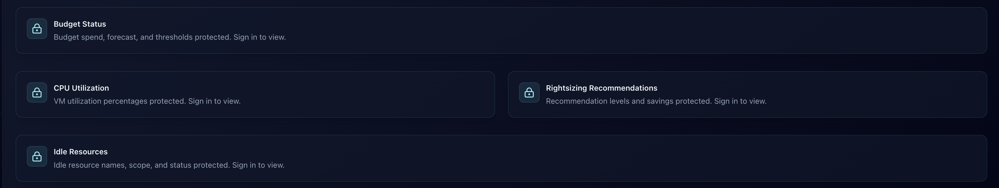

* **Budgets** – configured budgets with placeholder spent/forecast values

* **CPU Utilization** – P95 per VM (last hour), 10-row preview with sort/view-all modal

* **Rightsizing Recommendations** – machine recommendations, 10-row preview with sort/view-all modal

* **Idle Resources** – underutilized assets, 10-row preview with sort/view-all modal

* **Filtering and search** – FinOps list widgets use modal-based filters and modal search. CPU filters include rightsizing candidate and utilization range. Idle resource filters include scope, status, and resource type. Rightsizing filters include level and savings.

* **Savings Summary** – realized savings (`0.0`) + potential rightsizing savings

* **Mock / fallback warning** – if `/api/finops` fails and the UI falls back to bundled FinOps data, the header diagnostic pill lists the affected FinOps sections.

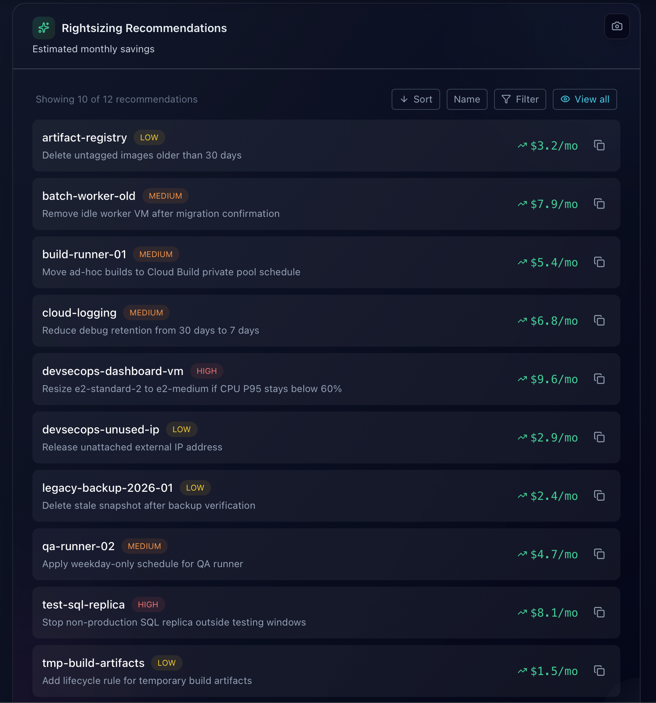


> Data is sourced from GCP APIs (BigQuery, Monitoring, Recommender, Budgets).
> Initial data population may be delayed (see below).

---

### FinOps Data Population Latency

| Feature           | Latency        | Notes                                            |
| ----------------- | -------------- | ------------------------------------------------ |
| CPU utilization   | 5–10 minutes   | Monitoring API (1-min collection, 5-min queries) |
| Cost trends       | ~24 hours      | BigQuery billing export (daily)                  |
| Top services      | ~24 hours      | Same as cost trends                              |
| Budgets           | Near real-time | API-based                                        |
| Rightsizing       | 24–48 hours    | Requires usage history                           |
| Idle resources    | 24–48 hours    | Same as above                                    |
| Realized savings  | N/A            | Not implemented                                  |
| Potential savings | 24–48 hours    | Derived from recommendations                     |

> First-time billing export may take **up to 24 hours**.

---

## Ambiance (Shared Feature)

Ambiance is available before sign-in in both DevSecOps and FinOps modes. It uses public static assets under `/data`, so quotes, particles, and the photo gallery do not require protected API access.

### Featured Quote

* Random quote loaded from `/data/quotes.json`, staged from `shared/assets/quotes/quotes.json`
* Manual refresh button selects a new quote
* ⭐ Bookmark quotes → saved locally
* View/manage favorites via `localStorage`

---

### Screensaver

Interactive particle background (click to cycle):

* **Drift** – drifting cyan particles with connecting lines

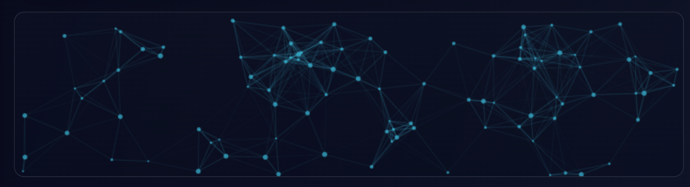

* **Haze** – kinetic purple particles that randomly settle into geometric patterns

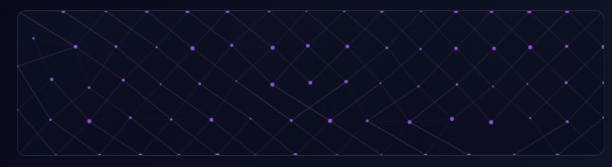

* **State** – white static particles that glow and snap to new positions


---

### International Photo Gallery

* Images loaded from `/data/images` + `/data/gallery-manifest.json`, staged from `shared/assets/images/image_gallery`
* Local Vite fallback uses the shared repository gallery assets if `/data/gallery-manifest.json` is unavailable
* Responsive grid layout

Features:

* ℹ️ View image metadata (title + location)
* ⭐ Save favorites (local)
* ✈️ Open Google Travel Explore for liked destinations
* 🏠 “Living info” Google search

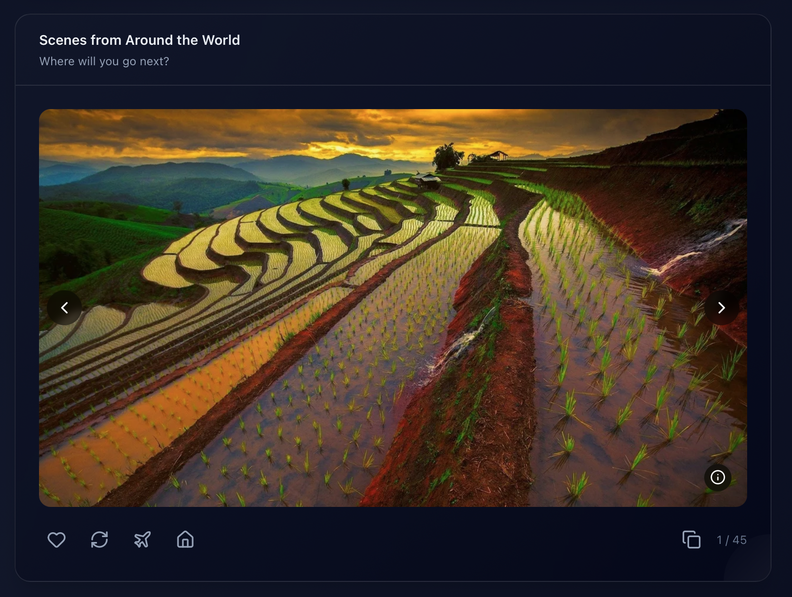

---

## Monitoring Endpoints

Quick reference for built-in endpoints:

* `/healthz` – plain text health check
* `/metadata` – protected VM metadata + health JSON
* `/api/dashboard/summary` – public DevSecOps summary cards with protected utilization values redacted
* `/api/dashboard` – protected DevSecOps data
* `/api/finops/summary` – public FinOps summary cards
* `/api/finops` – protected FinOps data
* `/api/config` – API config JSON
* `/api/logs` – protected paginated journal logs

The frontend Monitoring Endpoints card is part of the protected dashboard detail view.

## Endpoints (Quick Reference)

| Endpoint         | Method | Description                                      |
| ---------------- | ------ | ------------------------------------------------ |
| `/healthz`       | GET    | Returns `ok` for Nginx/service health checks     |
| `/metadata`      | GET    | Returns protected GCP VM identity, network, location, and health data |
| `/api/dashboard/summary` | GET | Returns public DevSecOps summary cards with protected CPU, Memory, Disk, and Estimated Cost values |
| `/api/dashboard` | GET    | Returns protected DevSecOps dashboard data       |
| `/api/finops/summary` | GET | Returns public FinOps summary cards |
| `/api/finops`    | GET    | Returns protected FinOps cost, budget, and recommendation data |
| `/api/config`    | GET    | Returns API runtime configuration                |
| `/api/logs`      | GET    | Returns protected paginated `journalctl` log rows |

---

## Example `/metadata` Response (GCP)

```json
{
  "STUDENT_NAME": "Kirk Alton",
  "project_id": "kirk-devsecops-sandbox",
  "instance_id": "1234567890123456789",
  "instance_name": "vm-dashboard",
  "hostname": "vm-dashboard.us-central1-a.c.kirk-devsecops-sandbox.internal",
  "machine_type": "e2-medium",
  "network": {
    "vpc": "main",
    "subnet": "private",
    "internal_ip": "10.0.1.4",
    "external_ip": "34.123.45.67"
  },
  "region": "us-central1",
  "zone": "us-central1-a",
  "startup_utc": "2026-04-29T14:58:42Z",
  "uptime": "up 2 hours, 14 minutes",
  "health": {
    "uptime": "up 2 hours, 14 minutes",
    "load_avg": "0.12, 0.18, 0.21",
    "ram_mb": {
      "used": 812,
      "free": 2450,
      "total": 3920
    },
    "disk_root": {
      "size": "20.0 GB",
      "used": "7.8 GB",
      "avail": "11.2 GB",
      "use_pct": "39%"
    }
  }
}
```

> [!NOTE]
> `STUDENT_NAME` can be overridden with a GCP custom metadata attribute named `STUDENT_NAME`. If the metadata attribute is missing, the API falls back to the hardcoded value in `scripts/dashboard_api.py`.

---

## HTTP vs HTTPS

The dashboard can run over plain HTTP or HTTPS.

| Access mode | Example | Result |
| ----------- | ------- | ------ |
| Public HTTP | `http://<VM_EXTERNAL_IP>` | Dashboard works, but browser clipboard features may be blocked |
| Local HTTP | `http://localhost` | Dashboard works, clipboard features usually work |
| HTTPS | `https://dashboard.kirkdevsecops.com` | Dashboard works, clipboard features work, traffic is encrypted |

---

### Clipboard API Limitation

Modern browsers only allow the Clipboard API in a **secure context**.

Clipboard copy actions generally work on:

* `https://`
* `http://localhost`

Clipboard copy actions may fail on:

* `http://<public-ip>`
* `http://dashboard.example.com`

This is a browser security restriction, not an application bug.

---

### Impact

When the dashboard is accessed over public HTTP:

* Text Mode copy shortcut (`C`) may fail
* Text Mode JSON copy (`J`) and log snapshot copy (`LS`) may fail
* Copy buttons may fail
* The dashboard still loads normally
* API calls, charts, logs, metadata, and FinOps data are otherwise unaffected

When the browser blocks a copy action, the UI opens a **Manual Copy** modal with the attempted snapshot or value already selected. The modal explains that clipboard access is unavailable on public HTTP or blocked by the browser and asks the user to highlight and copy the text manually.

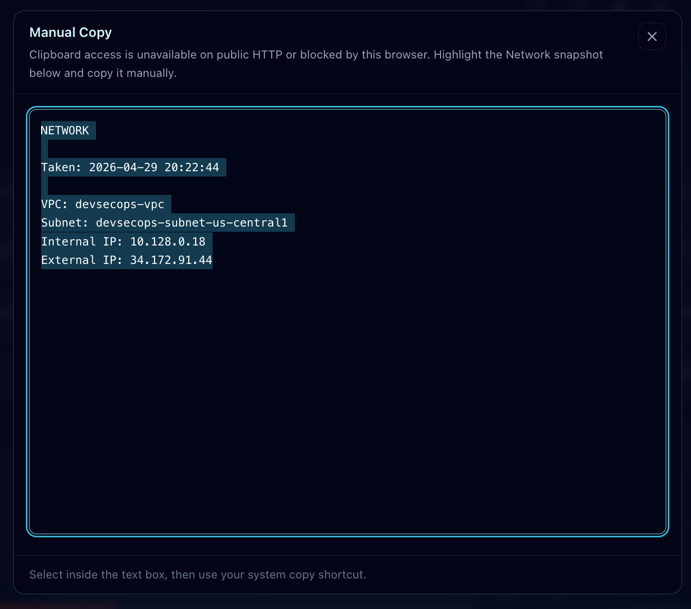

---

### Fix

Use HTTPS for the public dashboard URL, such as `https://dashboard.kirkdevsecops.com`.

The recommended path is `Route 53 DNS -> GCP static IP -> Nginx -> Certbot/Let’s Encrypt -> HTTPS dashboard`.

For quick testing without HTTPS, you can:

* access the dashboard locally through `http://localhost`
* use an SSH tunnel
* manually copy values from the UI instead of using the Clipboard API


## HTTPS and Certificates

For HTTPS, the dashboard needs a real DNS name and a trusted TLS certificate.

In this deployment, HTTPS is handled by:

* **Route 53** – points the dashboard hostname to the GCP VM static IP
* **Nginx** – serves the dashboard and terminates TLS
* **Certbot** – requests and renews a free Let’s Encrypt certificate
* **Let’s Encrypt** – issues the trusted certificate

Certificate files live on the VM under `/etc/letsencrypt/live/<dashboard-hostname>/`.

Important files:

| File | Purpose |
| ---- | ------- |
| `fullchain.pem` | Public certificate chain used by Nginx |
| `privkey.pem` | Private key used by Nginx |

> [!IMPORTANT]
> Let’s Encrypt certificates are issued for DNS names, not raw IP addresses. Use a hostname such as `dashboard.kirkdevsecops.com`, not `https://<VM_EXTERNAL_IP>`.


## Roadmap & Upcoming Features

### Security & HTTPS

* [x] HTTPS support with Nginx, Certbot, and Let’s Encrypt
* [x] Route 53 DNS integration for Terraform deployments
* [ ] Certificate status check in the dashboard
* [ ] Nginx security headers for HTTPS deployments

### Deployment

* [x] HTTP ClickOps deployment path
* [x] Terraform HTTPS deployment path
* [ ] Post-deploy validation script for DNS, HTTP, HTTPS, and API health
* [ ] Deployment status endpoint showing git commit, build time, and service state

### Logs & Observability

* [x] Paginated `/api/logs` endpoint
* [x] ISO 8601 UTC log timestamps
* [ ] Nginx and Certbot status/log summary
* [ ] Optional systemd service status cards for `nginx` and `dashboard-api`

### Clipboard & UX

* [x] Manual-copy fallback modal for public HTTP or blocked browser clipboard access
* [x] Header “Copy Snapshot” button
* [x] Header JSON payload button
* [x] Widget-level snapshot buttons
* [x] Item-level copy buttons with contextual success toasts
* [x] JSON System Logs copy payloads

### Export

* [x] Plain-text dashboard snapshot
* [x] JSON dashboard snapshot
* [x] JSON System Logs snapshots
* [ ] `/api/snapshot` endpoint

## License

MIT License – free to use, modify, and distribute.

---
