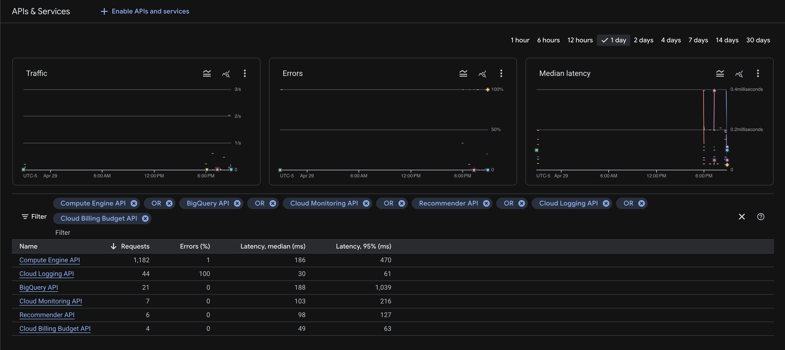
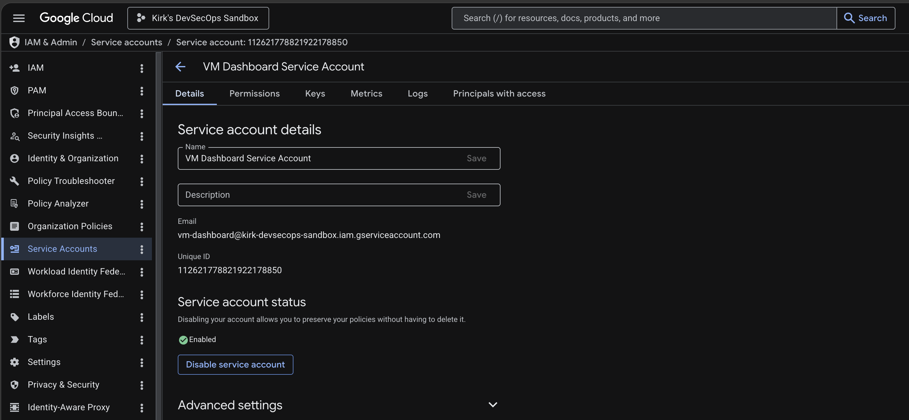
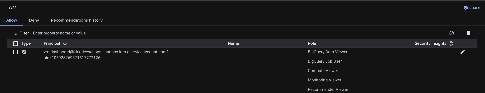
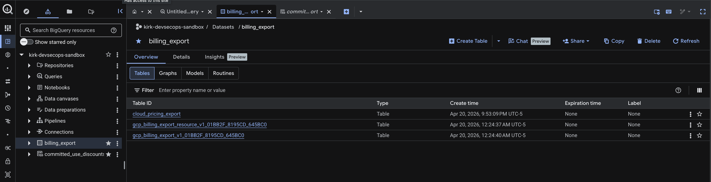
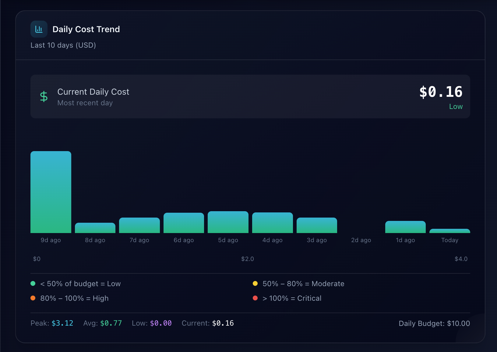
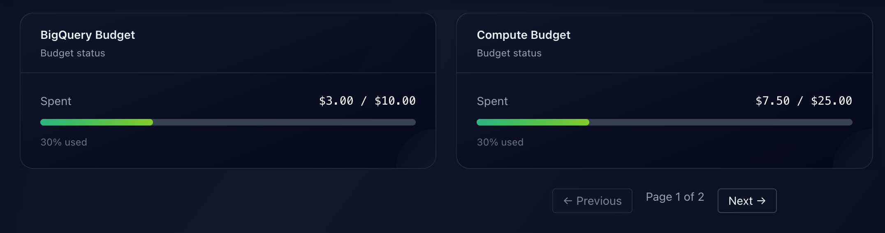

# **Prerequisites Setup for FinOps Dashboard**

## **Purpose**

This runbook defines all prerequisite configuration required **before** deploying the VM dashboard infrastructure. It ensures a dedicated service account is created, assigned the required permissions, and ready to be attached **at VM deployment time** (covered in a separate runbook).

---

## **What This Enables in the Dashboard**

| Dashboard Feature | Required Permission / API | Enabled by Step |
|------------------|---------------------------|----------------|
| **Real cost data** (BigQuery) | `bigquery.dataViewer`, `bigquery.jobUser` | 3.2 |
| **Budgets & alerts** | `billing.viewer`, `billingbudgets.googleapis.com` | 3.1, 1 |
| **CPU utilization** (per VM) | `monitoring.viewer`, `monitoring.googleapis.com` | 3.2, 1 |
| **Rightsizing recommendations** | `recommender.viewer`, `recommender.googleapis.com` | 3.2, 1 |
| **Cost trends & forecasts** | BigQuery billing export | 4 |
| **Idle resources** | `recommender.viewer` | 3.2 |
| **Service account identity** | Custom service account created | 2.1 |

---

## **Prerequisites**

- Installed and authenticated Google Cloud SDK (`gcloud auth login`)
- Active GCP project with billing enabled
- **Required IAM roles** (temporary, for setup):
  - `roles/billing.admin` (on the billing account)
  - `roles/owner` (on the project)

---

## **Deployment Mode Prerequisites**

The dashboard can be deployed as HTTP-only or HTTPS.

### **Terraform vs Manual Responsibility**

| Prerequisite | HTTP ClickOps VM | Terraform HTTPS |
| --- | --- | --- |
| Required GCP APIs | Enable manually | Terraform enables in `terraform/02-required-api.tf` |
| VM dashboard service account | Create manually | Terraform creates it |
| VM dashboard project IAM roles | Grant manually | Terraform grants them |
| Billing viewer role for dashboard service account | Grant manually | Terraform grants it |
| VM OAuth scope | Configure on VM | Terraform configures it |
| Secret Manager auth secrets and secret versions | Create manually | Create manually |
| VM service account access to auth secrets | Grant manually | Terraform grants dashboard secret access |
| Pub/Sub topic for secret events | Create manually | Create manually outside Terraform |
| Secret Manager service-agent publisher binding on Pub/Sub topic | Grant manually | Grant manually outside Terraform |
| BigQuery billing export | Configure in GCP Console | Configure in GCP Console |

> [!NOTE]
> Terraform intentionally does not create the dashboard auth secrets, secret values, or external secret-rotation Pub/Sub topic. Those resources should survive `terraform destroy`, so they stay coupled to your secret-management process instead of the dashboard VM lifecycle.

### **HTTP ClickOps VM Deployment**

For a manual GCP Console VM deployment using `infra/startup/gcp_startup.sh`, you need:

- A Debian 11 or Ubuntu 20.04/22.04 VM
- A public external IP if you want browser access from the internet
- Inbound firewall access on TCP `80`
- Internet egress from the VM for package installs and GitHub clone
- A service account attached to the VM with the roles listed in Stage 3
- VM OAuth scopes that include `https://www.googleapis.com/auth/cloud-platform`

This path serves the dashboard at `http://<VM_EXTERNAL_IP>`.

It does not configure DNS, HTTPS, Certbot, or a TLS certificate.

### **Terraform HTTPS Deployment**

For the Terraform-based HTTPS path, you also need:

- Inbound firewall access on TCP `443`
- A public DNS name, such as `dashboard.kirkdevsecops.com`
- An AWS Route 53 public hosted zone for the root domain, or a manually managed DNS record
- AWS credentials with permission to read the hosted zone and create/update the `A` record, if Terraform manages DNS
- A Let’s Encrypt contact email
- DNS pointing the dashboard hostname to the GCP VM static external IP

This path serves the dashboard at `https://dashboard.kirkdevsecops.com`.

> [!IMPORTANT]
> HTTPS does not determine whether the dashboard shows real or fallback data. Real data depends on GCP IAM, APIs, service account scopes, and BigQuery billing export.

---

## **Stage 1: Enable Required APIs**

```bash
gcloud services enable \
  compute.googleapis.com \
  cloudbilling.googleapis.com \
  billingbudgets.googleapis.com \
  recommender.googleapis.com \
  monitoring.googleapis.com \
  bigquery.googleapis.com \
  logging.googleapis.com \
  pubsub.googleapis.com \
  secretmanager.googleapis.com
```



> [!NOTE]
> This step is required once per project. If any API fails, check your project owner permissions.
> For Terraform deployments, Terraform enables these APIs in `terraform/02-required-api.tf`; you do not need to run this command separately unless you are creating the external secrets or Pub/Sub topic before your first `terraform apply`.
> Secret Manager event notifications use the Google-managed service agent `service-${PROJECT_NUMBER}@gcp-sa-secretmanager.iam.gserviceaccount.com`, which must have `roles/pubsub.publisher` on the external `vm-dashboard-secret-events` topic.

---

## **Stage 2: Create Service Account & Set Variables**

> [!NOTE]
> Skip service account creation for Terraform deployments. Terraform creates the `vm-dashboard` service account and attaches it to the VM. Use this section for HTTP ClickOps deployments or for setting shell variables used by the manual CLI examples.

### **2.1 Create a Dedicated Service Account**

```bash
export PROJECT_ID="kirk-devsecops-sandbox"   # Replace with your project ID

gcloud iam service-accounts create vm-dashboard \
  --project=${PROJECT_ID} \
  --display-name="VM Dashboard Service Account"
```

> [!NOTE]
> Result: `vm-dashboard@${PROJECT_ID}.iam.gserviceaccount.com`

### **2.2 Set Environment Variables**

```bash
export BILLING_ACCOUNT_ID="01BB2F-8195CD-645BC0"   # Your billing account ID
export SA_EMAIL="vm-dashboard@${PROJECT_ID}.iam.gserviceaccount.com"
```

> [!TIP]
> A dedicated service account is recommended for production. It improves audit clarity and follows least privilege more closely than the default Compute Engine service account.



---

## **Stage 3: Assign IAM Permissions and Roles**

> [!NOTE]
> Skip Stages 3.1 and 3.2 for Terraform deployments. Terraform grants the VM dashboard service account the billing, BigQuery, Compute, Monitoring, Recommender, Logging, and Secret Manager access needed by the deployed VM. Use these manual IAM commands for HTTP ClickOps deployments.

### **3.1 Billing Account (for Budgets & Cost data)**

```bash
gcloud beta billing accounts add-iam-policy-binding ${BILLING_ACCOUNT_ID} \
  --member="serviceAccount:${SA_EMAIL}" \
  --role="roles/billing.viewer"
```

**Enables:** Budgets, billing account metadata, cost data (via BigQuery export)

> [!NOTE]
> Budgets API read access is included in `roles/billing.viewer`.
> No additional role is required for listing or viewing budgets within the billing account.

### **3.2 Project-Level Roles**

```bash
export PROJECT_ID="kirk-devsecops-sandbox"   # Replace with your project ID

# Compute Viewer – subnet name retrieval (DevSecOps network card)
gcloud projects add-iam-policy-binding ${PROJECT_ID} \
    --member="serviceAccount:${SA_EMAIL}" \
    --role="roles/compute.viewer"

# BigQuery Data Viewer – read billing export tables
gcloud projects add-iam-policy-binding ${PROJECT_ID} \
  --member="serviceAccount:${SA_EMAIL}" \
  --role="roles/bigquery.dataViewer"

# BigQuery Job User – run queries
gcloud projects add-iam-policy-binding ${PROJECT_ID} \
  --member="serviceAccount:${SA_EMAIL}" \
  --role="roles/bigquery.jobUser"

# Monitoring Viewer – CPU utilization metrics
gcloud projects add-iam-policy-binding ${PROJECT_ID} \
  --member="serviceAccount:${SA_EMAIL}" \
  --role="roles/monitoring.viewer"

# Recommender Viewer – rightsizing & idle resources
gcloud projects add-iam-policy-binding ${PROJECT_ID} \
  --member="serviceAccount:${SA_EMAIL}" \
  --role="roles/recommender.viewer"

# Secret Manager Secret Accessor is granted at the secret level in section 3.3.
# This keeps dashboard auth secret access scoped to only the four required secrets.
```

> [!NOTE]
> Enables BigQuery cost queries, CPU utilization metrics, rightsizing recommendations, and idle resource recommendations.
> Dashboard Basic Auth credential access is granted directly on the four Secret Manager secrets in the next section.



---

### **3.3 Dashboard Auth Secrets, Pub/Sub Topic, and Rotation Notifications**

The dashboard uses four manually managed Secret Manager secrets for Basic Auth:

| Secret ID | Purpose |
| --- | --- |
| `vm-dashboard-dev-username` | DevSecOps username |
| `vm-dashboard-dev-password` | DevSecOps password |
| `vm-dashboard-finops-username` | FinOps username |
| `vm-dashboard-finops-password` | FinOps password |

Create or update the secrets before deploying the VM:

> [!NOTE]
> Required for both HTTP ClickOps and Terraform deployments. Terraform passes only the secret IDs to VM metadata; it does not create the secrets or store secret values in Terraform state.

```bash
# Project ID
export PROJECT_ID="kirk-devsecops-sandbox"   # Replace with your project ID

# DevSecOps secret IDs
export DEV_USER_SECRET="vm-dashboard-dev-username"
export DEV_PASSWORD_SECRET="vm-dashboard-dev-password"

# FinOps secret IDs
export FINOPS_USER_SECRET="vm-dashboard-finops-username"
export FINOPS_PASSWORD_SECRET="vm-dashboard-finops-password"

# DevSecOps secret values (replace with your credentials)
export DEV_USERNAME="dashboard"
export DEV_PASSWORD="YOUR_DEV_PASSWORD"

# FinOps secret values (replace with your credentials)
export FINOPS_USERNAME="finops"
export FINOPS_PASSWORD="YOUR_FINOPS_PASSWORD"


# DEVSECOPS — Username Secret
gcloud secrets describe "${DEV_USER_SECRET}" --project="${PROJECT_ID}" >/dev/null 2>&1 || \
gcloud secrets create "${DEV_USER_SECRET}" \
  --project="${PROJECT_ID}" \
  --replication-policy="automatic"

printf '%s' "${DEV_USERNAME}" | \
gcloud secrets versions add "${DEV_USER_SECRET}" \
  --project="${PROJECT_ID}" \
  --data-file=-


# DEVSECOPS — Password Secret
gcloud secrets describe "${DEV_PASSWORD_SECRET}" --project="${PROJECT_ID}" >/dev/null 2>&1 || \
gcloud secrets create "${DEV_PASSWORD_SECRET}" \
  --project="${PROJECT_ID}" \
  --replication-policy="automatic"

printf '%s' "${DEV_PASSWORD}" | \
gcloud secrets versions add "${DEV_PASSWORD_SECRET}" \
  --project="${PROJECT_ID}" \
  --data-file=-


# FINOPS — Username Secret
gcloud secrets describe "${FINOPS_USER_SECRET}" --project="${PROJECT_ID}" >/dev/null 2>&1 || \
gcloud secrets create "${FINOPS_USER_SECRET}" \
  --project="${PROJECT_ID}" \
  --replication-policy="automatic"

printf '%s' "${FINOPS_USERNAME}" | \
gcloud secrets versions add "${FINOPS_USER_SECRET}" \
  --project="${PROJECT_ID}" \
  --data-file=-


# FINOPS — Password Secret
gcloud secrets describe "${FINOPS_PASSWORD_SECRET}" --project="${PROJECT_ID}" >/dev/null 2>&1 || \
gcloud secrets create "${FINOPS_PASSWORD_SECRET}" \
  --project="${PROJECT_ID}" \
  --replication-policy="automatic"

printf '%s' "${FINOPS_PASSWORD}" | \
gcloud secrets versions add "${FINOPS_PASSWORD_SECRET}" \
  --project="${PROJECT_ID}" \
  --data-file=-
```

Grant the VM dashboard service account access to only those four secrets:

> [!NOTE]
> Skip this secret-access binding step for Terraform deployments. Terraform grants the dashboard VM service account Secret Manager access. For HTTP ClickOps deployments, run these commands so the VM can read the four auth secrets during bootstrap.

```bash
export PROJECT_ID="kirk-devsecops-sandbox"   # Replace with your project ID

gcloud secrets add-iam-policy-binding "${DEV_USER_SECRET}" \
  --project="${PROJECT_ID}" \
  --member="serviceAccount:${SA_EMAIL}" \
  --role="roles/secretmanager.secretAccessor"

gcloud secrets add-iam-policy-binding "${DEV_PASSWORD_SECRET}" \
  --project="${PROJECT_ID}" \
  --member="serviceAccount:${SA_EMAIL}" \
  --role="roles/secretmanager.secretAccessor"

gcloud secrets add-iam-policy-binding "${FINOPS_USER_SECRET}" \
  --project="${PROJECT_ID}" \
  --member="serviceAccount:${SA_EMAIL}" \
  --role="roles/secretmanager.secretAccessor"

gcloud secrets add-iam-policy-binding "${FINOPS_PASSWORD_SECRET}" \
  --project="${PROJECT_ID}" \
  --member="serviceAccount:${SA_EMAIL}" \
  --role="roles/secretmanager.secretAccessor"
```

Create or reuse the external Pub/Sub topic for Secret Manager notifications:

> [!NOTE]
> Required for both HTTP ClickOps and Terraform deployments. Terraform does not manage this topic or the Secret Manager service-agent publisher binding because secret event notifications should persist independently of the dashboard VM.

```bash
export PROJECT_ID="kirk-devsecops-sandbox"   # Replace with your project ID

export SECRET_EVENTS_TOPIC="vm-dashboard-secret-events"
export PROJECT_NUMBER="$(gcloud projects describe "${PROJECT_ID}" --format="value(projectNumber)")"
export SECRET_MANAGER_SERVICE_AGENT="service-${PROJECT_NUMBER}@gcp-sa-secretmanager.iam.gserviceaccount.com"

gcloud beta services identity create \
  --service="secretmanager.googleapis.com" \
  --project="${PROJECT_ID}"

gcloud pubsub topics describe "${SECRET_EVENTS_TOPIC}" --project="${PROJECT_ID}" >/dev/null 2>&1 || \
  gcloud pubsub topics create "${SECRET_EVENTS_TOPIC}" \
    --project="${PROJECT_ID}"

gcloud pubsub topics add-iam-policy-binding "${SECRET_EVENTS_TOPIC}" \
  --project="${PROJECT_ID}" \
  --member="serviceAccount:${SECRET_MANAGER_SERVICE_AGENT}" \
  --role="roles/pubsub.publisher"
```

Attach the topic to all four auth secrets, then configure 90-day rotation reminders on the password secrets only:

> [!NOTE]
> Required for both HTTP ClickOps and Terraform deployments when you want Secret Manager event notifications and 90-day password rotation reminders. Rotation is configured only on password secrets.

```bash
export PROJECT_ID="kirk-devsecops-sandbox"   # Replace with your project ID

NEXT_ROTATION="$(python3 -c 'from datetime import datetime, timezone, timedelta; print((datetime.now(timezone.utc)+timedelta(days=90)).strftime("%Y-%m-%dT%H:%M:%SZ"))')"

gcloud secrets update "${DEV_USER_SECRET}" \
  --project="${PROJECT_ID}" \
  --add-topics="projects/${PROJECT_ID}/topics/${SECRET_EVENTS_TOPIC}"

gcloud secrets update "${DEV_PASSWORD_SECRET}" \
  --project="${PROJECT_ID}" \
  --add-topics="projects/${PROJECT_ID}/topics/${SECRET_EVENTS_TOPIC}"

gcloud secrets update "${FINOPS_USER_SECRET}" \
  --project="${PROJECT_ID}" \
  --add-topics="projects/${PROJECT_ID}/topics/${SECRET_EVENTS_TOPIC}"

gcloud secrets update "${FINOPS_PASSWORD_SECRET}" \
  --project="${PROJECT_ID}" \
  --add-topics="projects/${PROJECT_ID}/topics/${SECRET_EVENTS_TOPIC}"

gcloud secrets update "${DEV_PASSWORD_SECRET}" \
  --project="${PROJECT_ID}" \
  --next-rotation-time="${NEXT_ROTATION}" \
  --rotation-period="7776000s"

gcloud secrets update "${FINOPS_PASSWORD_SECRET}" \
  --project="${PROJECT_ID}" \
  --next-rotation-time="${NEXT_ROTATION}" \
  --rotation-period="7776000s"
```

> [!IMPORTANT]
> The VM service account needs `roles/secretmanager.secretAccessor` on the secrets. The Secret Manager service agent needs `roles/pubsub.publisher` on the Pub/Sub topic. These are two different identities and two different IAM bindings.
> The Secret Manager service agent does not need access to read secret values; it only publishes event metadata to Pub/Sub.


---

## **Stage 4: Configure Billing Export to BigQuery**

> **Required for real cost data.** Without this, the dashboard will show empty cost trends.

> [!NOTE]
> Required for both HTTP ClickOps and Terraform deployments. Terraform does not configure Cloud Billing export to BigQuery.

### **4.1 Console Method (Recommended)**

1. Go to **Billing** → **BigQuery Export**
2. Click **Edit settings**
3. Choose your project (`${PROJECT_ID}`) and dataset name `billing_export`
4. Click **Save**



> [!WARNING]
> Enabling Cloud Billing export to BigQuery can only be done through the GCP Console UI. There is no `gcloud` CLI command or stable REST API endpoint to configure it, so the `/v1/billingAccounts/{id}/exportSettings` endpoint returns 404. There is no Terraform resource for this either.

> [!IMPORTANT]
> After enabling, data appears within **24 hours**. The dashboard will show `[]` (empty) until then.

---

## **Stage 5: Verify Permissions**

Run these commands to confirm permissions are correct.

> [!NOTE]
> For Terraform deployments, run these checks after `terraform apply` if you want to verify what Terraform created. You do not need to run the manual IAM grant commands from Stages 2, 3.1, or 3.2.

```bash
# 1. Verify Service Account Exists
gcloud iam service-accounts list --filter="email:${SA_EMAIL}"

# 2. Project IAM Roles
gcloud projects get-iam-policy ${PROJECT_ID} --flatten="bindings[].members" --format="table(bindings.role)" --filter="bindings.members:${SA_EMAIL}"

# 3. Billing Account IAM (roles/billing.viewer)
gcloud beta billing accounts get-iam-policy ${BILLING_ACCOUNT_ID} --format=json | grep -A2 ${SA_EMAIL}

# 4. Required APIs Enabled
gcloud services list --enabled --filter="compute.googleapis.com OR cloudbilling.googleapis.com OR billingbudgets.googleapis.com OR recommender.googleapis.com OR monitoring.googleapis.com OR bigquery.googleapis.com OR logging.googleapis.com OR secretmanager.googleapis.com OR pubsub.googleapis.com"

# 5. BigQuery Billing Export Dataset Exists
bq ls billing_export 2>/dev/null || echo "Dataset not found"

# 6. BigQuery Access (dry run query)
bq query --use_legacy_sql=false --dry_run "SELECT 1"

# 7. Recommender API Access
gcloud recommender recommendations list --project=${PROJECT_ID} --location=global --recommender=google.compute.instance.MachineTypeRecommender --limit=1

# 8. Budgets API Access
gcloud beta billing budgets list --billing-account=${BILLING_ACCOUNT_ID}

```

> [!WARNING]
> `gcloud` does not support Monitoring time series queries. Use the Monitoring API via curl.

```bash
# 9. Monitoring API access (may return empty array)

# 10a. Linux (GNU date):
curl -H "Authorization: Bearer $(gcloud auth print-access-token)" \
"https://monitoring.googleapis.com/v3/projects/$PROJECT_ID/timeSeries?filter=metric.type=\"compute.googleapis.com/instance/cpu/utilization\"&interval.endTime=$(date -u +"%Y-%m-%dT%H:%M:%SZ")&interval.startTime=$(date -u -d '1 hour ago' +"%Y-%m-%dT%H:%M:%SZ")"

# 10b. macOS (BSD date):
curl -H "Authorization: Bearer $(gcloud auth print-access-token)" \
"https://monitoring.googleapis.com/v3/projects/$PROJECT_ID/timeSeries?filter=metric.type=\"compute.googleapis.com/instance/cpu/utilization\"&interval.endTime=$(date -u +"%Y-%m-%dT%H:%M:%SZ")&interval.startTime=$(date -u -v-1H +"%Y-%m-%dT%H:%M:%SZ")"

# 10c. Windows (PowerShell):
$end = (Get-Date).ToUniversalTime().ToString("yyyy-MM-ddTHH:mm:ssZ")
$start = (Get-Date).ToUniversalTime().AddHours(-1).ToString("yyyy-MM-ddTHH:mm:ssZ")
$token = gcloud auth print-access-token

curl -H "Authorization: Bearer $token" "https://monitoring.googleapis.com/v3/projects/$env:PROJECT_ID/timeSeries?filter=metric.type=""compute.googleapis.com/instance/cpu/utilization""&interval.endTime=$end&interval.startTime=$start"
```

> [!NOTE]
> Errors indicating the absence of a `gcloud` command for Monitoring time series do not indicate missing permissions. Successful API calls (no 401/403) confirm access.

---

## **Stage 6: Pre-Deployment Checklist**

### HTTP ClickOps

- [ ] Service account created
- [ ] IAM roles assigned
- [ ] APIs enabled
- [ ] VM OAuth scope planned as `cloud-platform`
- [ ] Secret Manager auth secrets created
- [ ] VM service account has secret accessor access
- [ ] Pub/Sub secret-events topic configured
- [ ] Secret Manager service agent has Pub/Sub publisher access
- [ ] BigQuery billing export configured
- [ ] API access verified

### Terraform HTTPS

- [ ] Dashboard auth secrets and secret versions created manually
- [ ] External Pub/Sub secret-events topic configured manually
- [ ] Secret Manager service agent has Pub/Sub publisher access
- [ ] Password secret rotation reminders configured
- [ ] BigQuery billing export configured manually
- [ ] DNS/Route 53 prerequisites are ready
- [ ] Terraform variables/defaults reference the correct Secret Manager secret IDs

> [!NOTE]
> Terraform creates the VM service account, attaches it to the VM, enables required project APIs, grants dashboard IAM roles, and configures the VM OAuth scope. Do not duplicate those manual steps unless you are using the HTTP ClickOps path.

---

## **Stage 7: Deployment**
Use the **[Quick Start](./QUICKSTART.md)** runbook to create the VM and **attach the service account at creation time**.

> [!IMPORTANT]
> For HTTP ClickOps, do not create the VM before setting up this service account. The service account should be attached **during VM creation** to avoid unnecessary troubleshooting or reconfiguration.
> For Terraform, Terraform creates and attaches the service account for you.

---

## **Expected Outcome**
When deployed, the FinOps dashboard will display real-time system metrics.





---

## **Troubleshooting & Notes**

| Issue | Likely Cause | Fix |
|-------|--------------|-----|
| `billing budgets list` returns empty | No budgets created yet | Create a budget in GCP Console → Billing → Budgets |
| CPU utilization stays `[]` | VM just started or Monitoring API not enabled | Wait 5–10 minutes; verify API enabled (`gcloud services list --enabled`) |
| Cost trends empty after 24h | BigQuery export not configured | Re‑run Stage 4 or check Billing → BigQuery Export settings |
| Terraform fails on `google_billing_account_iam_member` | Your Terraform user lacks `billing.admin` | Run `gcloud billing accounts add-iam-policy-binding ... --role="roles/billing.admin"` for your user, or remove the billing IAM resource from Terraform |

---

## **Cleanup (Optional)**

```bash
# Remove IAM bindings
gcloud projects remove-iam-policy-binding ${PROJECT_ID} \
  --member="serviceAccount:${SA_EMAIL}" \
  --role="roles/bigquery.dataViewer"

# Delete service account
gcloud iam service-accounts delete ${SA_EMAIL}

# Unset variables
unset PROJECT_ID BILLING_ACCOUNT_ID SA_EMAIL
```

---

## **Key Takeaways**

- **Create the service account first**, then attach it during VM creation.
- **Use least privilege**; configure the custom service account with only `billing.viewer` and project-level read roles.
- **Billing export takes up to 24 hours**. The dashboard will not show cost data until then.
- **Budgets API is included in `billing.viewer`**. No extra role needed for read‑only access.

---

## **References**

- [GCP Billing IAM roles](https://cloud.google.com/billing/docs/how-to/billing-access)
- [BigQuery billing export setup](https://cloud.google.com/billing/docs/how-to/export-data-bigquery-setup)
- [Cloud Monitoring metrics list](https://cloud.google.com/monitoring/api/metrics_gcp)
