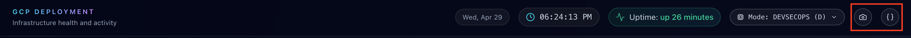

# Dashboard Frontend

React + Vite frontend for the VM Dashboard.

It renders:

- DevSecOps summary cards from `/api/dashboard/summary`, with protected details from `/api/dashboard`
- FinOps summary cards from `/api/finops/summary`, with protected details from `/api/finops`
- Text mode from the protected DevSecOps payload, plus `/api/logs` for the all-logs modal
- Quotes from `/data/quotes.json`
- Gallery images from `/data/images.json` and `/data/images/*`
- Client-side sort, filter, search, and view-all modals for logs, services, and FinOps tables
- Clipboard actions for dashboard snapshots, dashboard JSON payloads, widget snapshots, and JSON System Logs payloads
- A sign-in modal for Nginx Basic Auth protected dashboard sections, with Sign in buttons on the visible summary cards and locked panels

## Local Development

```bash
npm install
npm run dev
```

Access: `http://localhost:5173`


The Vite dev server has no proxy configured:

```js
export default defineConfig({
  plugins: [react()],
  build: {
    outDir: 'dist',
    sourcemap: false,
    rollupOptions: {
      output: {
        manualChunks: (id) => {
          // Put vendor dependencies into separate chunks
          if (id.includes('node_modules')) {
            if (id.includes('react') || id.includes('react-dom') || id.includes('react-router')) {
              return 'vendor-react'
            }
            if (id.includes('framer-motion') || id.includes('lucide-react')) {
              return 'vendor-ui'
            }
            return 'vendor'
          }
        }
      }
    }
  }
})
```

Because frontend requests use relative paths like `/api/dashboard`, local development falls back to bundled mock data unless the app is served behind Nginx or a local proxy is added.

Local sign-in uses development-only credentials because Vite does not run the VM Nginx Basic Auth layer. Set these values before starting Vite:

```bash
VITE_DASHBOARD_AUTH_USER=dashboard
VITE_DASHBOARD_AUTH_PASSWORD=your-local-dev-password
```

If `VITE_DASHBOARD_AUTH_PASSWORD` is not set, local sign-in stays locked. Production sign-in is enforced by Nginx using the hashed password file generated during VM bootstrap from Secret Manager.

In Vite development mode, `/api/logs` is intercepted by `dashboard/src/mockLogs.js` so the log modals can still demonstrate pagination, filtering, sorting, and older-log loading without a live `journalctl` API.

System Logs copy actions intentionally output JSON instead of plain text:

```json
{
  "system_logs": [
    {
      "timestamp": "2026-04-27T14:58:42Z",
      "level": "WARN",
      "component": "storage",
      "message": "Root disk at 92% after npm build artifacts; 4.0 GB free"
    }
  ]
}
```

Header controls include a camera icon for the dashboard snapshot and a `{}` icon for the JSON payload. Text mode mirrors this with `[C] COPY`, `[J] COPY JSON`, and `[LS] SNAPSHOT` inside the all-logs modal. The JSON payload structure is documented in [`docs/API_CONFIG.md`](../docs/API_CONFIG.md#clipboard-json-payload-structure).



## Build

```bash
npm run build
```

The bootstrap script runs this command as `appuser`, then copies `dashboard/dist/*` into `/var/www/vm-dashboard`.

## Build-Time Links

The sidebar links are read from Vite environment variables:

```js
const githubUrl = import.meta.env.VITE_GITHUB_URL || "https://github.com";
const linkedinUrl = import.meta.env.VITE_LINKEDIN_URL || "https://www.linkedin.com";
```

In VM deployments, `scripts/bootstrap/app_bootstrap.sh` exports:

```bash
export VITE_GITHUB_URL="https://github.com/KirkAlton-Class7"
export VITE_LINKEDIN_URL="https://www.linkedin.com/in/kirkcochranjr/"
```

Set these before `npm run build` if you need different links.
