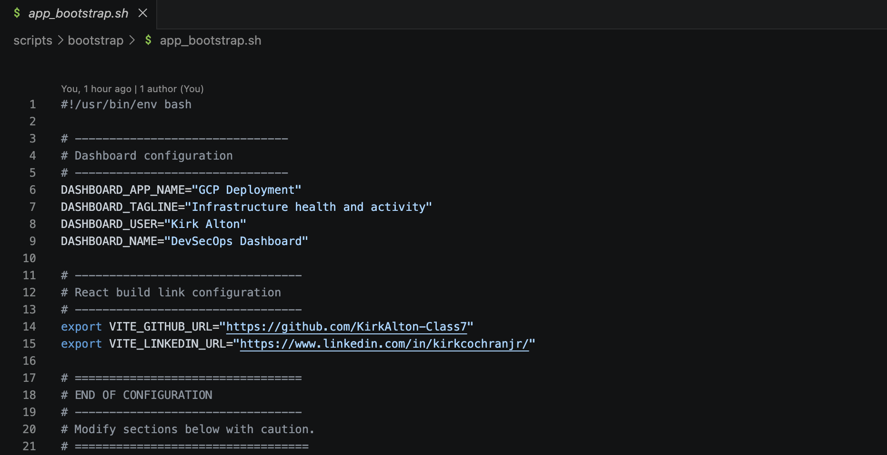
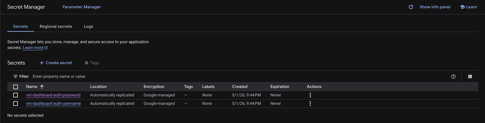
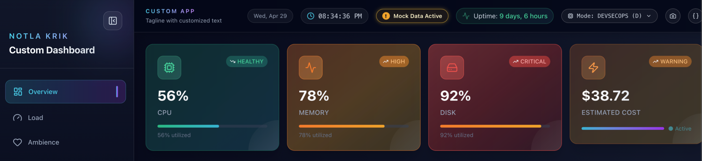

# Application Bootstrap Configuration

## Dashboard Customization – `app_bootstrap.sh`

The dashboard’s appearance and behavior can be customized by editing the variables at the top of `scripts/bootstrap/app_bootstrap.sh`. No other changes are required for standard customization.

---

## Editable Variables

Open `app_bootstrap.sh` and locate the **“Dashboard Customization”** block:

```bash
# -------------------------------
# Dashboard Customization
# -------------------------------
DASHBOARD_APP_NAME="GCP Deployment"
DASHBOARD_TAGLINE="Infrastructure health and activity"
DASHBOARD_USER="Kirk Alton"
DASHBOARD_NAME="DevSecOps Dashboard"

DASHBOARD_DEV_AUTH_USER="${DASHBOARD_DEV_AUTH_USER:-${DASHBOARD_AUTH_USER:-dashboard}}"
DASHBOARD_DEV_AUTH_PASSWORD="${DASHBOARD_DEV_AUTH_PASSWORD:-${DASHBOARD_AUTH_PASSWORD:-}}"
DASHBOARD_DEV_AUTH_USER_SECRET_ID="${DASHBOARD_DEV_AUTH_USER_SECRET_ID:-${DASHBOARD_AUTH_USER_SECRET_ID:-}}"
DASHBOARD_DEV_AUTH_PASSWORD_SECRET_ID="${DASHBOARD_DEV_AUTH_PASSWORD_SECRET_ID:-${DASHBOARD_AUTH_PASSWORD_SECRET_ID:-}}"

DASHBOARD_FINOPS_AUTH_USER="${DASHBOARD_FINOPS_AUTH_USER:-finops}"
DASHBOARD_FINOPS_AUTH_PASSWORD="${DASHBOARD_FINOPS_AUTH_PASSWORD:-}"
DASHBOARD_FINOPS_AUTH_USER_SECRET_ID="${DASHBOARD_FINOPS_AUTH_USER_SECRET_ID:-}"
DASHBOARD_FINOPS_AUTH_PASSWORD_SECRET_ID="${DASHBOARD_FINOPS_AUTH_PASSWORD_SECRET_ID:-}"

# ---------------------------------
# Env Variables for React build
# ---------------------------------
export VITE_GITHUB_URL="https://github.com/KirkAlton-Class7"
export VITE_LINKEDIN_URL="https://www.linkedin.com/in/kirkcochranjr/"
```



Update these values as needed:

| Variable             | Purpose                                    | Example                        |
| -------------------- | ------------------------------------------ | ------------------------------ |
| `DASHBOARD_APP_NAME` | Displayed in the top-left corner of the UI | `My Dashboard`                 |
| `DASHBOARD_TAGLINE`  | Subtitle beneath the app name              | `Live infrastructure insights` |
| `DASHBOARD_USER`     | Shown in the sidebar (user attribution)    | `Jane Doe`                     |
| `DASHBOARD_NAME`     | Title of the dashboard (sidebar heading)   | `Ops Center`                   |
| `DASHBOARD_DEV_AUTH_USER` | Fallback username for protected DevSecOps data | `dashboard` |
| `DASHBOARD_DEV_AUTH_PASSWORD` | Fallback password for protected DevSecOps data | Usually unset |
| `DASHBOARD_DEV_AUTH_USER_SECRET_ID` | Secret Manager secret ID/resource path for the DevSecOps username | `vm-dashboard-dev-username` |
| `DASHBOARD_DEV_AUTH_PASSWORD_SECRET_ID` | Secret Manager secret ID/resource path for the DevSecOps password | `vm-dashboard-dev-password` |
| `DASHBOARD_FINOPS_AUTH_USER` | Fallback username for protected FinOps data | `finops` |
| `DASHBOARD_FINOPS_AUTH_PASSWORD` | Fallback password for protected FinOps data | Usually unset |
| `DASHBOARD_FINOPS_AUTH_USER_SECRET_ID` | Secret Manager secret ID/resource path for the FinOps username | `vm-dashboard-finops-username` |
| `DASHBOARD_FINOPS_AUTH_PASSWORD_SECRET_ID` | Secret Manager secret ID/resource path for the FinOps password | `vm-dashboard-finops-password` |
| `VITE_GITHUB_URL`    | GitHub link compiled into the React build  | `https://github.com/example`   |
| `VITE_LINKEDIN_URL`  | LinkedIn link compiled into the React build | `https://www.linkedin.com/in/example/` |

> [!TIP]
> `DASHBOARD_*` values are exported for the API service and returned through `/api/dashboard`. `VITE_*` values are read by Vite during `npm run build`, so they require a frontend rebuild.

> [!WARNING]
> Do not hardcode passwords in public repos or for production. Instead, store credentials manually in **GCP Secret Manager** and pass the secret IDs through Terraform metadata. Nginx stores only local hashed password files; the frontend only sends credentials entered by the user and does not embed passwords in JavaScript.

> [!WARNING]
> Never hardcode passwords in Terraform, frontend code, or public repos. Instead, store credentials manually in GCP Secret Manager and pass secret names/IDs through Terraform metadata. This prevents passwords from being written to Terraform state files.

> [!INFO]
> On the VM, Nginx uses locally stored hashed password files only. The frontend does not contain or store passwords in JavaScript; it simply sends user-entered credentials securely at login.

### Secret Manager Credentials

The bootstrap resolves DevSecOps and FinOps Basic Auth credentials in this order:

1. Secret Manager secret IDs from environment variables.
2. Secret Manager secret IDs from VM metadata:
   - `dashboard-dev-auth-user-secret`
   - `dashboard-dev-auth-password-secret`
   - `dashboard-finops-auth-user-secret`
   - `dashboard-finops-auth-password-secret`
3. Direct environment variables:
   - `DASHBOARD_DEV_AUTH_USER`
   - `DASHBOARD_DEV_AUTH_PASSWORD`
   - `DASHBOARD_FINOPS_AUTH_USER`
   - `DASHBOARD_FINOPS_AUTH_PASSWORD`


> [!INFO]
Both password values must resolve to non-empty values. The script fails closed if either protected area is missing a password.

Secret Manager is accessed during VM bootstrap only. The script then writes `/etc/nginx/.vm-dashboard-dev.htpasswd` and `/etc/nginx/.vm-dashboard-finops.htpasswd` with hashed credentials, and Nginx uses those local files for Basic Auth checks. Browser sign-in attempts do not call Secret Manager.

The username and password secrets can be created and versioned manually outside Terraform. The current expected secret IDs are:

* `vm-dashboard-dev-username`
* `vm-dashboard-dev-password`
* `vm-dashboard-finops-username`
* `vm-dashboard-finops-password`



The Pub/Sub notification topic should also be managed outside Terraform. Use the topic ID `vm-dashboard-secret-events` and attach all four secrets for event notifications. Configure rotation only on the password secrets so rotation reminders persist with the secrets after dashboard infrastructure is destroyed.


If a VM deployment appears to hang during credential setup, check `/var/log/startup-script.log` for `Secret Manager credential lookup enabled`. Common causes are a missing secret version, `secretmanager.googleapis.com` not enabled, the VM service account missing `roles/secretmanager.secretAccessor`, or no outbound path to `secretmanager.googleapis.com`. Metadata lookups fail quickly, and Secret Manager calls use a bounded timeout so these failures should be visible in the startup log.

---

## Configuration Boundary

```bash
# ==================================
# END OF CONFIGURATION
# ---------------------------------
# Modify sections below with caution.
# ==================================
```

> [!IMPORTANT]
> Treat this as a **hard boundary**:
>
> * Above → safe for customizing dashboard branding and React build links
> * Below → deployment automation logic (package installation, repository sync, file paths, services, Nginx, cron jobs, and build/deploy steps)
---

## GitHub Content Source

```bash
GITHUB_QUOTES_URL="https://raw.githubusercontent.com/KirkAlton-Class7/devsecops-vm-dashboard/main/quotes.json"
```

* **`GITHUB_QUOTES_URL`** – Raw GitHub URL used to download the dashboard quote dataset. It must point to a valid, publicly accessible `quotes.json` file.

> [!NOTE]
> This value only controls where quote data is downloaded from.
> The repository clone URL is configured separately in the VM startup wrapper (`infra/startup/gcp_startup.sh`). If you deploy from a fork, update the wrapper script as well.

---

## System and Path Configuration (Reference)

The following values define how the application is deployed on the VM:

```bash
# -------------------------------
# System User
# -------------------------------
APP_USER="appuser"

# -------------------------------
# Application Paths
# -------------------------------
APP_NAME="vm-dashboard"
APP_DIR="/var/www/${APP_NAME}"
NGINX_SITE="/etc/nginx/sites-available/${APP_NAME}"
DATA_DIR="${APP_DIR}/data"
```

> [!CAUTION]
> These values affect system-level behavior (Nginx, file paths, permissions).
> Modify only if you understand the implications on your deployment environment.

---

## Applying Changes

1. Edit `app_bootstrap.sh` in your local repository.
2. Commit and push the changes to the Git repository cloned by the VM startup wrapper (`infra/startup/gcp_startup.sh`).
3. The VM’s auto-deploy cron job runs `/opt/dashboard-deploy.sh` every 15 minutes and rebuilds when the local checkout differs from `origin/main`.

The auto-deploy script is intentionally conservative:

- It uses a deploy lock so overlapping cron/manual runs do not build at the same time.
- It builds the React frontend before touching the active Nginx web root.
- It copies hashed assets before `index.html`, which prevents the browser from receiving HTML that references missing JavaScript/CSS files.
- If `git pull`, dependency install, or `npm run build` fails, the existing deployed dashboard is left in place.

To trigger an immediate update:

```bash
sudo /opt/dashboard-deploy.sh
```

> [!TIP]
> If changes do not appear, check:
>
> * `/var/log/bootstrap.log`
> * `/var/log/dashboard-deploy.log`
> * `/var/log/startup-script.log`

---

## Environment Variables (Optional)

If running the Python API outside of the startup script, define the dashboard branding variables before starting it:

```bash
export DASHBOARD_APP_NAME="Custom App"
export DASHBOARD_TAGLINE="Tagline with customized text"
export DASHBOARD_USER="Notla Krik"
export DASHBOARD_NAME="Custom Dashboard"
```

These values are returned by the Python API in the `/api/dashboard` response and consumed by the frontend at runtime.



> [!NOTE]
> `VITE_GITHUB_URL` and `VITE_LINKEDIN_URL` are build-time React variables. Set them before `npm run build`; changing them after the site is built will not update the deployed frontend.

---
