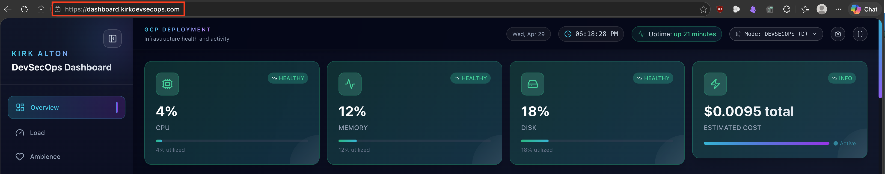

# Quickstart

## Prerequisites & IAM Setup

> See [GCP Prerequisites Runbook](./PREREQUISITES.md)

**Quick summary:**

* **Enable APIs**: `compute`, `bigquery`, `monitoring`, `logging`, `recommender`, `billingbudgets`, `cloudbilling`.
* **Create a custom service account** (recommended) or use the default Compute Engine service account.
* **Grant IAM roles**:
  * `roles/billing.viewer` on the **billing account**
  * `roles/compute.viewer`, `roles/bigquery.dataViewer`, `roles/bigquery.jobUser`, `roles/monitoring.viewer`, `roles/recommender.viewer` on the **project**.
* **Set up BigQuery billing export** to a dataset named `billing_export`.
* **Ensure the VM is created with the `cloud-platform` OAuth scope**.

The FinOps dashboard will show real data only after these prerequisites are met and the BigQuery export has populated (up to 24 hours).

---

## Quick Start

> [!IMPORTANT]
> Deployment is fully automated using a startup script.

This project supports two deployment paths:

| Path | Result | Best for |
| --- | --- | --- |
| **HTTP ClickOps VM deployment** | Serves the dashboard at `http://<VM_EXTERNAL_IP>` | Labs, demos, fast manual GCP Console deployment |
| **Terraform HTTPS deployment** | Serves the dashboard at `https://dashboard.<domain>` | Repeatable infrastructure with DNS and TLS |

The dashboard application does not require HTTPS to show real data. Real versus fallback data depends on GCP APIs, IAM roles, service account scopes, and BigQuery billing export. HTTPS only changes how browsers securely connect to the already-running dashboard.

---

## HTTP ClickOps Deployment

Use this path when creating a VM manually in the GCP Console and pasting a startup script into the VM metadata field.

1. **Copy the appropriate bootstrap script** into your VM’s user‑data / startup script field.
   * Use `infra/startup/gcp_startup.sh` as the **wrapper** – it installs `git`, clones the repo to `/opt/deploy`, and then runs the main bootstrap.


2. **Launch a VM** (Debian 11 or Ubuntu 20.04/22.04 recommended).

3. **Wait 5–10 minutes** while the scripts:
   * Install basic tools (nginx, Python, Node.js, git, **Google Cloud SDK**)
   * Clone the repository to `/opt/deploy`
   * Install Python packages (`google-cloud-bigquery`, `google-cloud-monitoring`, etc.)
   * Create a systemd service for the Python API (`dashboard-api.service`) on port 8080
   * Build the React frontend
   * Configure Nginx to serve the dashboard and proxy `/api/` and `/metadata` to the Python API
   * Set up cron jobs for quotes (every 10 min), pricing (monthly), and auto‑deploy (every 15 min)
   * Start everything

4. **Open the VM’s public IP** in your browser at `http://<VM_EXTERNAL_IP>`.


The HTTP ClickOps path does **not** configure HTTPS, Certbot, Route 53, or a TLS certificate.

> [!TIP]
> Logs are written to `/var/log/bootstrap.log` and `/var/log/startup-script.log` for troubleshooting.

> [!IMPORTANT]
> The dashboard may take up to 10 minutes to fully install, build, and populate images and quotes.
> FinOps data may take up to 24 hours to appear after enabling BigQuery billing export.

---

## HTTPS Terraform Deployment

Use this path when deploying with Terraform and a real DNS name.

The Terraform deployment can coordinate:

- GCP VM creation
- GCP static external IP
- firewall rules for `80` and `443`
- GCP service account and IAM roles
- AWS Route 53 `A` record
- instance metadata for the dashboard hostname and Let’s Encrypt email

The VM startup script then:

1. installs the dashboard over HTTP first
2. reads `dashboard-hostname` and `letsencrypt-email` from GCP metadata
3. waits until DNS resolves to the VM public IP
4. installs Certbot in `/opt/certbot-venv`
5. requests a Let’s Encrypt certificate
6. updates Nginx to redirect HTTP to HTTPS

Expected HTTPS URL: `https://dashboard.kirkdevsecops.com`



> [!NOTE]
> Let’s Encrypt certificates are issued for domain names, not raw IP addresses. Test HTTPS with the hostname, not `https://<VM_EXTERNAL_IP>`.

### HTTPS Requirements

- A public domain name, such as `kirkdevsecops.com`
- A public DNS record pointing the dashboard hostname to the VM static IP
- inbound firewall access for ports `80` and `443`
- VM internet egress so Certbot can reach Let’s Encrypt
- a Let’s Encrypt contact email
- Nginx serving HTTP before Certbot runs

### HTTPS Troubleshooting

| Check | Command |
| --- | --- |
| DNS record | `dig +short dashboard.kirkdevsecops.com` |
| HTTP response | `curl -I http://dashboard.kirkdevsecops.com` |
| HTTPS response | `curl -I https://dashboard.kirkdevsecops.com` |
| HTTPS setup service | `sudo systemctl status vm-dashboard-https.service` |
| HTTPS setup logs | `sudo journalctl -u vm-dashboard-https.service --no-pager` |
| Certbot certificates | `sudo /opt/certbot-venv/bin/certbot certificates` |
| Renewal dry run | `sudo /opt/certbot-venv/bin/certbot renew --dry-run` |

See **[Terraform HTTPS with GCP + Route 53](./terraform_docs/HTTPS_SETUP.md)** for the full infrastructure setup.

---

## Dashboard Customization (Bootstrap Script)

See **[`docs/APP_CONFIG.md`](./APP_CONFIG.md)**.

**Quick variables** (edit at the top of `app_bootstrap.sh`):

```bash
DASHBOARD_APP_NAME="GCP Deployment"
DASHBOARD_TAGLINE="Infrastructure health and activity"
DASHBOARD_USER="Kirk Alton"
DASHBOARD_NAME="DevSecOps Dashboard"
VITE_GITHUB_URL="https://github.com/KirkAlton-Class7"
VITE_LINKEDIN_URL="https://www.linkedin.com/in/kirkcochranjr/"
```

Protected dashboard credentials should come from GCP Secret Manager for production:

```bash
gcloud secrets create vm-dashboard-auth-username \
  --replication-policy="automatic"

printf '%s' 'dashboard' | \
  gcloud secrets versions add vm-dashboard-auth-username --data-file=-

gcloud secrets create vm-dashboard-auth-password \
  --replication-policy="automatic"

printf '%s' 'use-a-long-unique-password' | \
  gcloud secrets versions add vm-dashboard-auth-password --data-file=-
```

Terraform passes the secret IDs to the VM as metadata. The bootstrap fetches the secret values at runtime and writes only a hashed password to Nginx.

> [!NOTE]
> Do not edit below the configuration block unless you know what you are doing.

---

## Dashboard API Configuration

See **[`docs/API_CONFIG.md`](./API_CONFIG.md)**.

**User‑configurable variable** (`scripts/dashboard_api.py`):

```python
STUDENT_NAME = "Kirk Alton"
BILLING_ACCOUNT_ID = "01BB2F-8195CD-645BC0"
```

**Important notes**:

- The API caches dashboard data for 10 seconds, update status for 5 minutes, and FinOps queries for up to 1 hour.
- `/api/logs` reads paginated `journalctl` rows and supports `limit`, `offset`, and optional `minutes`. When `minutes` is set, it queries journalctl with `--since`.
- Public browser access is limited to summary endpoints until a user signs in. Nginx protects `/api/dashboard`, `/api/finops`, `/api/logs`, and `/metadata` with Basic Auth.
- Heuristic DevSecOps cost data is written to `/var/tmp/vm-cost.json` (persists across reboots).
- Quotes are read from `/var/www/vm-dashboard/data/quotes.json` (updated by cron).
- Real FinOps cost data is read from the `billing_export` BigQuery dataset.

If VM is already deployed, restart the service after modifying the API:

```bash
sudo systemctl restart dashboard-api.service
```

---

## **Verify Permissions on VM (Post Deployment)**

```bash
# 1. Compute Viewer (subnet fallback) – requires a running VM
VM_NAME=$(gcloud compute instances list --limit=1 --format="value(name)")
ZONE=$(gcloud compute instances list --limit=1 --format="value(zone)")
gcloud compute instances describe ${VM_NAME} --zone=${ZONE} --format="json" | jq '.networkInterfaces[0].subnetwork'
```
> [!NOTE]
> Expected result: a subnetwork URL, such as `"projects/your-project/regions/us-central1/subnetworks/default"`.
> If empty or `null`, the service account lacks `roles/compute.viewer` or the VM has no subnet.

```bash
# 2. VM Service Account Scopes (run from the VM itself)
curl -H "Metadata-Flavor: Google" http://metadata.google.internal/computeMetadata/v1/instance/service-accounts/default/scopes | grep cloud-platform
```
> [!NOTE]
> Expected result: output contains `https://www.googleapis.com/auth/cloud-platform`.
> If missing, the VM was created with insufficient scopes. Stop the VM and update scopes to `cloud-platform`.


```bash
# 3. Final API Tests (run after VM deployment, on the VM)
curl -s http://127.0.0.1:8080/api/dashboard | jq '.meta.dashboardName'
```
> [!NOTE]
> Expected result: the dashboard name you configured, such as `"DevSecOps Dashboard"`.
> If empty or error, the API service is not running. Check with `sudo systemctl status dashboard-api.service`.

```bash
curl -s http://127.0.0.1:8080/api/finops | jq '.summaryCards'
```
> [!NOTE]
> Expected result: a JSON array with four summary cards: Total Cost MTD, Forecast EOM, Potential Savings, and CUD Coverage.
> Values may be `"0.00"` if no data is available yet. If you see `"Error building FinOps data"`, check the API logs with `sudo journalctl -u dashboard-api.service -n 50`. This often indicates missing IAM roles or an unconfigured BigQuery export.

```bash
curl -s "http://127.0.0.1:8080/api/logs?limit=5&offset=0&minutes=10" | jq '.logs[0]'
```
> [!NOTE]
> Expected result: a log object with `time`, `level`, `source`, and `message`.
> Log timestamps are emitted as ISO 8601 UTC strings, such as `2026-04-27T14:58:42Z`. The React UI formats them for local display.

> [!NOTE]
> These local API tests run directly against `127.0.0.1:8080` and bypass Nginx. Public browser traffic goes through Nginx and requires the dashboard username/password for protected endpoints.

### Verify Copy and Snapshot Controls

The graphical DevSecOps and FinOps headers include two copy controls:

| Button | Purpose |
| ------ | ------- |
| Camera icon | Copies the current dashboard snapshot |
| `{}` icon | Copies the current dashboard JSON payload |

Text Mode includes:

| Control | Purpose |
| ------- | ------- |
| `[C] COPY` | Copies the DevSecOps dashboard text snapshot |
| `[J] COPY JSON` | Copies the DevSecOps dashboard JSON payload |
| `[LL]` then `[LS] SNAPSHOT` | Opens all logs, then copies the loaded/filter-matched logs as JSON |


System Logs copy actions use this JSON shape:

```json
{
  "system_logs": [
    {
      "timestamp": "2026-04-27T14:58:42Z",
      "level": "WARN",
      "component": "storage",
      "message": "Root disk at 92% after npm build artifacts; 4.0 GB free"
    }
  ]
}
```

Dashboard JSON payload structure is documented in [API Configuration](./API_CONFIG.md#clipboard-json-payload-structure).

---

## Local Development

### Clone the repository

```bash
git clone https://github.com/KirkAlton-Class7/devsecops-vm-dashboard.git
cd devsecops-vm-dashboard/dashboard
```

### Run the React frontend

```bash
npm install
npm run dev
```

Access: `http://localhost:5173`

### Run the Python API locally

```bash
cd ..
python3 scripts/dashboard_api.py
```

The API will listen on `http://localhost:8080`.

> [!NOTE]
> The Vite dev server does not define an API proxy. In local development, frontend calls to `/api/dashboard` on `localhost:5173` fall back to mock dashboard data unless you serve through Nginx or add a local proxy.
> `/api/logs` is intercepted in Vite development mode and served from `dashboard/src/mockLogs.js`, which keeps the all-logs modal useful for demos without a live `journalctl` backend.

### Test Manual Copy Fallback Locally

To simulate an HTTP/blocked-clipboard browser context during local development, open `http://localhost:5173/?HttpTest=1`.


Copy buttons will use the same Manual Copy modal path that public HTTP deployments use when the browser blocks Clipboard API access. This test flag is local-only and is ignored on the deployed HTTPS dashboard.

---

## Repository Structure

```
devsecops-vm-dashboard/
├── dashboard/               # React frontend (Vite + Tailwind)
│   ├── public/data/         # Static quotes, images, and image metadata served by Vite/Nginx
│   └── src/
│       ├── components/      # React UI components
│       ├── config/          # Frontend navigation/config
│       ├── data/            # Mock dashboard and FinOps data
│       └── utils/           # Clipboard and snapshot formatters
├── images/                  # Source gallery images copied into dashboard/public/data/images
├── images.json              # Source image metadata
├── quotes.json              # Source featured quotes
├── scripts/
│   ├── bootstrap/
│   │   └── app_bootstrap.sh # Main dashboard deployment script
│   ├── dashboard_api.py     # Python API (metadata + live dashboard data)
│   └── fetch_pricing.py     # Pricing cache generator
├── infra/startup/
│   └── gcp_startup.sh       # VM startup wrapper script
├── terraform/               # Terraform stack for GCP VM, IAM, networking, Route 53 DNS, and HTTPS metadata
│   ├── 00-authentication.tf
│   ├── 02-required-api.tf
│   ├── 03-vpc.tf
│   ├── 04-subnets.tf
│   ├── 05-router.tf
│   ├── 06-nat.tf
│   ├── 07-firewall.tf
│   ├── 08-compute.tf
│   ├── 08-static-ip.tf
│   ├── 09-outputs.tf
│   ├── 10-service-accounts.tf
│   ├── 11-dns.tf
│   ├── locals.tf
│   ├── variables.tf
│   └── scripts/             # Terraform startup script copies and helper scripts
├── docs/terraform_docs/     # Terraform deployment and service account runbooks
└── README.md
```

---

## Cloud Provider Support

| Provider     | Metadata           | FinOps Support           | Auto‑deploy  |
| ------------ | ------------------ | ------------------------ | ------------ |
| **GCP**      | Full               | Full (BigQuery, etc.)    | cron         |
| **Local VM** | fallback detection | None                     | manual/dev   |
| **Azure**    | Not implemented    | None                     | not implemented |
| **AWS**      | Not implemented    | None                     | not implemented |

> [!NOTE]
> FinOps features are only available on GCP. The DevSecOps dashboard works on any Linux VM with internet access.

---

## Troubleshooting Quick Commands

| Check | Command |
|-------|---------|
| API service status | `sudo systemctl status dashboard-api.service` |
| API response (DevSecOps) | `curl -s http://localhost:8080/api/dashboard | jq '.meta.dashboardName'` |
| API response (FinOps) | `curl -s http://localhost:8080/api/finops | jq '.summaryCards'` |
| API response (logs) | `curl -s "http://localhost:8080/api/logs?limit=5&offset=0" | jq '.logs'` |
| Nginx status | `sudo systemctl status nginx` |
| Frontend through nginx | `curl -s http://localhost/ | grep -o "<title>"` |
| Bootstrap logs | `sudo tail -100 /var/log/bootstrap.log` |
| Auto-deploy logs | `sudo tail -100 /var/log/dashboard-deploy.log` |
| Startup script logs | `sudo tail -100 /var/log/startup-script.log` |
| API logs | `sudo journalctl -u dashboard-api.service -n 50` |
| Billing account ID test | `curl -s http://localhost:8080/api/dashboard | jq '.identity.billingAccountId'` |

---

## Known Limitations

- **Cost estimation** (DevSecOps card) is heuristic (static price × uptime). It is **not** a real billing API call. For real cost data, use the FinOps dashboard.
- **External IP fallback** uses `ifconfig.me`; if the VM has no internet, external IP will show `unknown`.
- **Azure / AWS** provider adapters are not implemented in the current codebase.
- **Clipboard API access** usually requires HTTPS or localhost. On public HTTP, copy actions fall back to the Manual Copy modal when the browser blocks clipboard access.
- **Auto-deploy behavior** keeps the existing frontend in place if the Git pull, dependency install, or frontend build fails. Review `/var/log/dashboard-deploy.log` when a pushed update does not appear.
- **FinOps data** requires BigQuery billing export, which takes up to 24 hours to populate after first setup.
