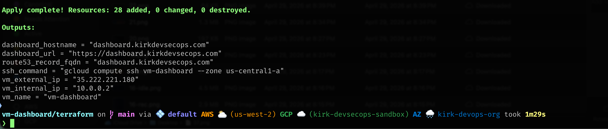
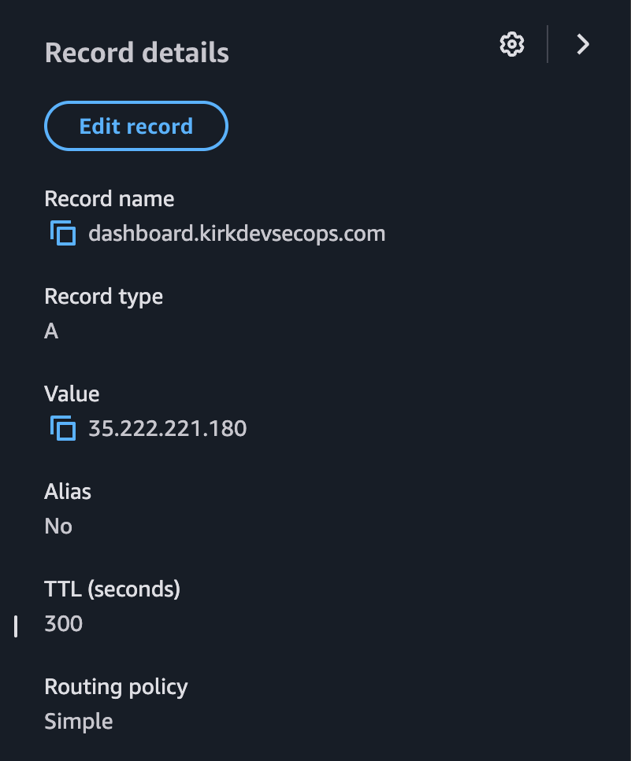
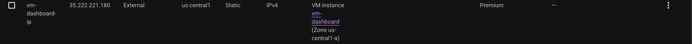
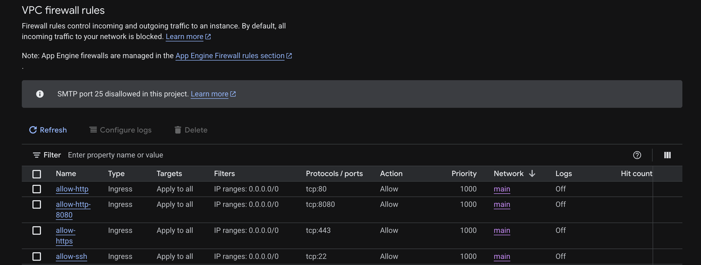
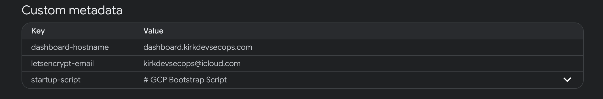
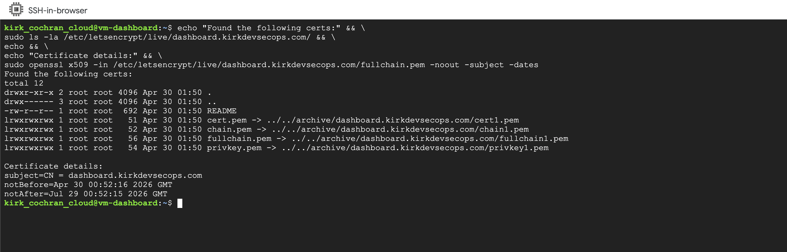

# Terraform GCP VM Dashboard with Route 53 HTTPS

## Purpose

This runbook explains the Terraform deployment model for serving the VM dashboard over HTTPS.

The Terraform setup is multi-cloud:

| Provider | Responsibility |
| --- | --- |
| `google` | GCP VM, VPC/subnet, firewall, static IP, service account, IAM roles |
| `aws` | Route 53 DNS record for the dashboard hostname |

The certificate itself is issued on the VM by Certbot. Terraform does not store the certificate private key.

---

## Deployment Flow

1. Terraform reserves a GCP static external IP.
2. Terraform creates or looks up the Route 53 hosted zone.
3. Terraform creates an `A` record for the dashboard hostname.
4. Terraform creates the GCP VM and passes metadata:
   - `dashboard-hostname`
   - `letsencrypt-email`
5. The VM startup script installs the dashboard over HTTP.
6. The HTTPS helper waits until DNS resolves to the VM public IP.
7. Certbot requests a Let’s Encrypt certificate.
8. Certbot updates Nginx for HTTPS and HTTP-to-HTTPS redirect.

Expected result: `https://dashboard.kirkdevsecops.com`



---

## Required Terraform Providers

The Terraform configuration requires both providers:

```hcl
terraform {
  required_providers {
    google = {
      source  = "hashicorp/google"
      version = "~> 5.0"
    }
    aws = {
      source  = "hashicorp/aws"
      version = "~> 5.0"
    }
  }
}
```

The Google provider deploys the VM. The AWS provider manages Route 53.

---

## Provider Configuration

```hcl
provider "google" {
  project = "kirk-devsecops-sandbox"
  region  = "us-central1"
}

provider "aws" {
  region  = var.aws_region
  profile = var.aws_profile
}
```

If you use the default AWS credential chain, leave `aws_profile = null`.

If you use a named AWS CLI profile, set it with a tfvars file or CLI variable:

```bash
terraform apply -var="aws_profile=your-profile-name"
```

---

## DNS Variables

The deployment uses these variables:

```hcl
variable "root_domain" {
  default = "kirkdevsecops.com"
}

variable "dashboard_subdomain" {
  default = "dashboard"
}

variable "dashboard_hostname" {
  default  = null
  nullable = true
}

variable "create_route53_record" {
  default = true
}

variable "manage_route53_in_terraform" {
  default = false
}
```

By default, Terraform builds the hostname from `dashboard_subdomain.root_domain`.

Default result: `dashboard.kirkdevsecops.com`

If you want to override the full hostname directly, set `dashboard_hostname = "custom.kirkdevsecops.com"`.

---

## Route 53 Hosted Zone Behavior

The default behavior assumes the public hosted zone already exists in Route 53 with `manage_route53_in_terraform = false`.

Terraform looks up the hosted zone and creates the dashboard `A` record.

Use this if the domain was already registered and configured in AWS.

If you intentionally want Terraform to create the hosted zone, set `manage_route53_in_terraform = true`.

Only use this when you understand the Route 53 nameserver implications. Creating a new hosted zone does not automatically update registrar nameservers.

---

## DNS Record

Terraform creates:

```hcl
resource "aws_route53_record" "vm_dashboard" {
  count = var.create_route53_record ? 1 : 0

  allow_overwrite = true
  zone_id         = local.route53_zone_id
  name            = local.dashboard_fqdn
  type            = "A"
  ttl             = 300
  records         = [google_compute_address.vm_dashboard.address]
}
```

This points `dashboard.kirkdevsecops.com` to the GCP VM static external IP.



---

## Static IP

Terraform reserves a GCP static IP:

```hcl
resource "google_compute_address" "vm_dashboard" {
  name   = "vm-dashboard-ip"
  region = "us-central1"
}
```

The VM uses this IP:

```hcl
access_config {
  nat_ip = google_compute_address.vm_dashboard.address
}
```

This matters because DNS should point at a stable IP, not an ephemeral IP that changes after rebuilds.



---

## Firewall Rules

The dashboard needs:

| Port | Purpose |
| --- | --- |
| `80` | HTTP dashboard access and Let’s Encrypt HTTP validation |
| `443` | HTTPS dashboard access |
| `22` | SSH access, if needed |

For HTTPS:

```hcl
resource "google_compute_firewall" "allow_https" {
  name    = "allow-https"
  network = google_compute_network.main.name

  allow {
    protocol = "tcp"
    ports    = ["443"]
  }

  source_ranges = ["0.0.0.0/0"]
}
```



---

## VM Metadata for HTTPS

Terraform passes the hostname and email into the VM:

```hcl
metadata = {
  dashboard-hostname = local.dashboard_fqdn
  letsencrypt-email  = var.letsencrypt_email
}
```

The startup script reads these values from the GCP metadata service.

If these values are missing, the dashboard remains HTTP-only.



---

## Certbot and Certificate Storage

Certbot runs on the VM from an isolated Python virtual environment at `/opt/certbot-venv`.

The Certbot binary is `/opt/certbot-venv/bin/certbot`.

Certificate files are stored under `/etc/letsencrypt/live/dashboard.kirkdevsecops.com/`.

Important files:

| File | Purpose |
| --- | --- |
| `fullchain.pem` | Public certificate chain used by Nginx |
| `privkey.pem` | Private key used by Nginx |

Do not put `privkey.pem` into Terraform variables, outputs, or state.

---

## Nginx HTTPS Behavior

The dashboard first comes up over HTTP.

The app bootstrap configures Nginx with:

```nginx
listen 80 default_server;
server_name _;
```

The HTTPS helper later changes the server name to `server_name dashboard.kirkdevsecops.com;`.

Then Certbot updates Nginx to serve HTTPS and redirect HTTP to HTTPS.

Nginx handles TLS termination. The browser connects to Nginx over HTTPS, and Nginx proxies backend API calls to the local API over HTTP: `Browser -> HTTPS -> Nginx -> HTTP localhost:8080`.

This is acceptable because the backend API traffic stays inside the VM.

---

## HTTP-Only Behavior

If the VM is deployed without Route 53, hostname metadata, or Certbot, the dashboard still works over HTTP at `http://<VM_EXTERNAL_IP>`.

This is the expected behavior for ClickOps/manual VM deployments.

HTTPS failure does not make the dashboard use mock data. Mock or fallback data is controlled by app/API access to GCP services, IAM roles, OAuth scopes, and BigQuery billing export.

---

## Apply

Initialize providers:

```bash
terraform init
```

Validate:

```bash
terraform validate
```

Plan:

```bash
terraform plan
```

Apply:

```bash
terraform apply
```

If using a named AWS profile:

```bash
terraform apply -var="aws_profile=your-profile-name"
```

---

## Outputs

Useful outputs include:

| Output | Meaning |
| --- | --- |
| `vm_external_ip` | GCP static external IP |
| `dashboard_hostname` | DNS name used for HTTPS |
| `dashboard_url` | HTTPS URL |
| `ssh_command` | GCP SSH helper command |

---

## Destroy and Recreate Behavior

On destroy:

- the VM is destroyed
- certificate files on the VM are deleted with the VM
- the Route 53 record is removed if Terraform created it
- the static IP is released unless preserved outside this stack

On a fresh apply:

- Terraform creates infrastructure again
- DNS is recreated or updated
- the new VM starts over HTTP
- Certbot requests a new certificate after DNS points to the VM

Avoid repeated destroy/apply loops in a short time window because Let’s Encrypt has rate limits.

---

## Troubleshooting

Check DNS:

```bash
dig +short dashboard.kirkdevsecops.com
```

Check HTTP:

```bash
curl -I http://dashboard.kirkdevsecops.com
```

Check HTTPS:

```bash
curl -I https://dashboard.kirkdevsecops.com
```

Check the HTTPS setup service:

```bash
sudo systemctl status vm-dashboard-https.service
sudo journalctl -u vm-dashboard-https.service --no-pager
```

Check Certbot:

```bash
sudo /opt/certbot-venv/bin/certbot certificates
```



Test renewal:

```bash
sudo /opt/certbot-venv/bin/certbot renew --dry-run
```

Check Nginx:

```bash
sudo nginx -t
sudo systemctl status nginx
```

---

## Common Issues

| Symptom | Likely cause | Fix |
| --- | --- | --- |
| HTTP works but HTTPS hangs | Port `443` blocked or Nginx not listening on HTTPS | Check firewall and Certbot logs |
| Certbot says DNS is wrong | Route 53 record has not propagated or points to old IP | Check `dig +short` and Terraform output |
| HTTPS by IP fails | Certificate is for hostname, not IP | Use `https://dashboard.kirkdevsecops.com` |
| Certbot Python/OpenSSL error | OS Certbot package dependency mismatch | Use `/opt/certbot-venv/bin/certbot` |
| Dashboard shows fallback data | IAM/API/BigQuery prerequisites missing | Review [GCP prerequisites](../PREREQUISITES.md) |

---

## Best Practice

Use Terraform for infrastructure and DNS.

Use Certbot on the VM for certificate issuance and renewal.

Do not store certificate private keys in Terraform state.
